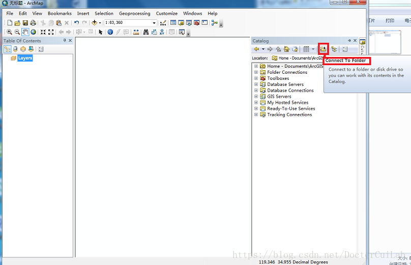
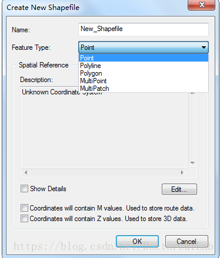
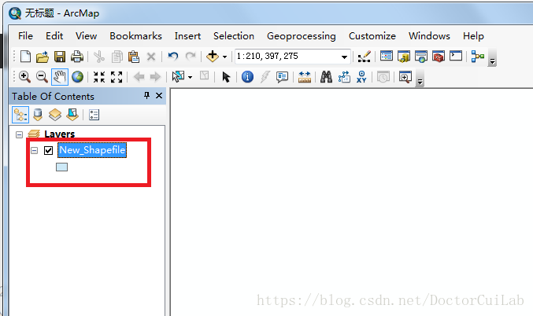

# 利用ArcMap提取关键区域信息

1、首先打开ArcMap，选择catalog按钮，并打开

2、点击Folder Connections按钮，选择存储新建立文件的文件夹，如下图所示

3、选择存储位置后（文中默认选择了桌面上的Newshp文件夹），然后右击该路径会出现一个“New”的选项，点击“New”的选项，出现下图所示列表选项，下面选择Shapefile选项，从而建立shp文件

4、点击Shapefile后得到下图Create new shapefile对话框。在其中，Name即要建立的shp文件的文件名；Feature Type为矢量类型（“point”点、“Polyline”线、“polygon”面）。Spatial Reference：空间参考

我一般是选择polygon，然后坐标选WGS 1984

5、点击 Edit按钮，添加地理坐标信息（文中选择了Geographic Coordinate Systems->World->WGS 1984）。然后点击“OK”按钮，此时一个shp格式的矢量就建好了。

6、建立好的矢量文件会自动加载到ArcMap左侧的“Table Of Contents”中

7、打开相应的遥感影像，右击.shp文件，会出现一个Edit Feature，然后点击Start Editing。

8、点击Start Editing ，ArcMap的右侧出现“Editor”和“Creat Features”两个工具栏，如下如所示。

注意：若没有出现“Creat Features”，可以点击下图出现：

9、点击“Creat Features”工具栏中创建的.shp文件，下面会出现几种画图的工具，可以选择Polygon（多边形）、Rectangle（矩形）等，这里默认选择多边形。

10、将遥感影像放大到一定比例后（将养殖区放在桌面的中间即可），选择感兴趣的区域，开始画矢量图。双击鼠标形成一个闭合面，效果如下图所示。（如果当前选取的标记点有误，选择“Ctrl”+“Z”取消当前步骤即可）。

11、最后将标记的感兴趣矢量文件进行保存。

