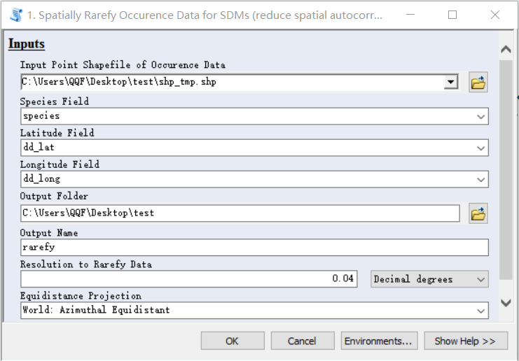

# 生态位和适应性区划建模教程

## 气候数据下载要点

可以直接在world clim网站上下载，主要分成三类：过去的气候数据，当下气候数据和未来气候数据。

过去的气候数据有末次盛冰期和中全新世两个时间，用到的CMIP5气候模式也不多。

当下气候数据是观测数据做统计降尺度。

未来气候数据是CMIP5所有模式的RCP情景输出结果，模式比较多。

数据下载有几个注意事项：

1. 现在气候数据有1.4版和2.0版两个版本，但是过去和未来的气候数据只有1.4版本。我试了下，如果用1.4版本的现在气候数据建模，模型迁移到未来或者过去会出现问题。因此，如果要做过去、未来的建模，建议观测数据的版本保持一致，用1.4版
2. 很多过去和未来的生态位建模文献只使用了一个气候模式，作为大气专业出身，我的建议是能用多少模式用多少模式，气候模式的不确定性非常高，一个模式得出的结论根本不可靠。

## 物种数据下载要点

物种分布数据可以直接从Global Biodiversity Information Facility（GBIF）、中国数字植物标本馆（CVH）等网站上面下载。但是要注意几个地方：

1. CVH上，国内的很多植物数据，描述的地点和经纬度对不上。需要手动剔除。另外，CVH上很多数据经纬度是在标本图片里的，需要自己一个个扒拉下来；
2. GBIF上很多数据是有错的，比如某个植物在我们国家被确定长江以北没有，但GBIF上居然有长江以北的标本。需要人工去掉这些错误样本。

因此，比较建议通过合作的方式获得精确详细的数据。

## 工具准备

需要的工具有：

1. ArcGIS，我用的是10.6版本
2. SDM Toolbox，我用的是2.4版本。安装到ArcGIS上（方法见第一步）。
3. GDAL，这个linux系统上，特别是Arch相关的发行版，可以直接pacman安装

## 第一步：样本稀疏化

样本数据整理成这样：


第一行是物种名、经度、纬度的名字。

之后每行对应写样本就行。

如果拿到的物种样本比较多，就需要做稀疏化，去掉一些高度相关的样本。利用的工具是ArcGIS和SDM Toolbox。


在ArcGIS右侧，鼠标右键，选择Add Toolbox


然后选择SDM Toolbox，点击open即可。

这一步可能很多人发现找不到SDM Toolbox的位置，没关系，点击右上角第五个图标，带+号的文件夹那个，就可以让ArcGIS链接SDM Toolbox的文件夹。


然后按照上面这张图，选择CSV，TXT or XLS to Shapefile，把这些格式中存储的物种分布经纬度信息转换成shapefile。


把这个上面的内容填上就好。output folder是输出结果存放的位置。


然后选择上图所示的工具，进行稀疏化



之后就可以在输出的目录里看到稀疏化后的csv文件了。

## 第二步：气候数据格式转换并提取关键区域

这一步其实可以分成几个小步骤：

（a）将tif格式的数据转换为asc格式，直接在linux系统下用GDAL做最简单。代码如下：

```shell
#!/bin/sh

for dir in 'bc26bi50'  'cc26bi50'  'ccmidbi'   'gs85bi70'  'he26bi50'  'hgmidbi'  'ipmidbi'  'melgmbi'  'mg85bi70'  'mi85bi70'  'mrlgmbi'  'no85bi70' 'bc26bi70'  'cc26bi70'  'cnmidbi'   'hd26bi50'  'he26bi70'  'ip26bi50'  'mc26bi50'  'memidbi'  'mgmidbi'  'mr26bi50'  'mrmidbi' 'bc45bi50'  'cc45bi50'  'gs26bi50'  'hd26bi70'  'he45bi50'  'ip26bi70'  'mc26bi70'  'mg26bi50'  'mi26bi50'  'mr26bi70'  'no26bi50' 'bc45bi70'  'cc45bi70'  'gs26bi70'  'hd45bi50'  'he45bi70'  'ip45bi50'  'mc45bi50'  'mg26bi70'  'mi26bi70'  'mr45bi50'  'no26bi70' 'bc60bi50'  'cc60bi50'  'gs45bi50'  'hd45bi70'  'he60bi50'  'ip45bi70'  'mc45bi70'  'mg45bi50'  'mi45bi50'  'mr45bi70'  'no45bi50' 'bc60bi70'  'cc60bi70'  'gs45bi70'  'hd60bi50'  'he60bi70'  'ip60bi50'  'mc60bi50'  'mg45bi70'  'mi45bi70'  'mr60bi50'  'no45bi70' 'bc85bi50'  'cc85bi50'  'gs60bi50'  'hd60bi70'  'he85bi50'  'ip60bi70'  'mc60bi70'  'mg60bi50'  'mi60bi50'  'mr60bi70'  'no60bi50' 'bc85bi70'  'cc85bi70'  'gs60bi70'  'hd85bi50'  'he85bi70'  'ip85bi50'  'mc85bi50'  'mg60bi70'  'mi60bi70'  'mr85bi50'  'no60bi70' 'bcmidbi'   'cclgmbi'   'gs85bi50'  'hd85bi70'  'hemidbi'  'ip85bi70'  'mc85bi70'  'mg85bi50'  'mi85bi50'  'mr85bi70'  'no85bi50'
do
	for bio in 1 2 3 4 5 6 7 8 9 10 11 12 13 14 15 16 17 18 19
	do
		gdal_translate ${dir}/${dir}${bio}.tif ../world_clim_1.4_asc/${dir}/${dir}${bio}.asc
		echo "$dir=========$bio========="
	done
done
```

(b) 利用做好的掩膜提取关键区域的数据。掩膜的制作方法参考这个repo下面《利用ArcMap提取关键区域信息》一文。有了掩膜以后，就可以用ArcPy批量做提取。代码如下：

```python
import arcpy
from arcpy import env
from arcpy.sa import *
import os

root = "D:"

env.workspace = "%s/tmp" % root

scenario = ['bc26bi50',  'cc26bi50',  'ccmidbi',  'gs85bi50',  'hd85bi70',  'hemidbi',  'ip85bi70',  'mc85bi70',  'mg85bi50',  'mi85bi50',  'mr85bi70',  'no85bi50','bc26bi70',  'cc26bi70',  'cnmidbi',  'gs85bi70',  'he26bi50',  'hgmidbi',  'ipmidbi',  'melgmbi',  'mg85bi70',  'mi85bi70',  'mrlgmbi',  'no85bi70','bc45bi50',  'cc45bi50',  'current',  'hd26bi50',  'he26bi70',  'ip26bi50',  'mc26bi50',  'memidbi',  'mgmidbi',  'mr26bi50',  'mrmidbi','bc45bi70',  'cc45bi70',  'gs26bi50',  'hd26bi70',  'he45bi50',  'ip26bi70',  'mc26bi70',  'mg26bi50',  'mi26bi50',  'mr26bi70',  'no26bi50','bc60bi50',  'cc60bi50',  'gs26bi70',  'hd45bi50',  'he45bi70',  'ip45bi50',  'mc45bi50',  'mg26bi70',  'mi26bi70',  'mr45bi50',  'no26bi70','bc60bi70',  'cc60bi70',  'gs45bi50',  'hd45bi70',  'he60bi50',  'ip45bi70',  'mc45bi70',  'mg45bi50',  'mi45bi50',  'mr45bi70',  'no45bi50','bc85bi50',  'cc85bi50',  'gs45bi70',  'hd60bi50',  'he60bi70',  'ip60bi50',  'mc60bi50',  'mg45bi70',  'mi45bi70',  'mr60bi50',  'no45bi70','bc85bi70',  'cc85bi70',  'gs60bi50',  'hd60bi70',  'he85bi50',  'ip60bi70',  'mc60bi70',  'mg60bi50',  'mi60bi50',  'mr60bi70',  'no60bi50','bcmidbi',  'cclgmbi',  'gs60bi70',  'hd85bi50',  'he85bi70',  'ip85bi50',  'mc85bi50',  'mg60bi70',  'mi60bi70',  'mr85bi50',  'no60bi70']

bios = ['1','2','3','4','5','6','7','8','9','10','11','12','13','14','15','16','17','18','19']

for scene in scenario:
	for bio in bios:
		infile = "%s/world_clim_1.4_asc/%s/%s%s.asc" % (root, scene, scene, bio)
		maskfile = "%s/mask/mask.shp" % root
		outfile = "%s/world_clim_mask/%s/bio_%s" % (root, scene, bio)
		check = "%s/world_clim_mask/%s" % (root, scene)
		if(not os.path.isdir(check)): os.makedirs(check)
		outExtractByMask = ExtractByMask(infile, maskfile)
		outExtractByMask.save(outfile)
		print("==============%s/%s==============" % (scene, bio))
	print("-----------------%s complete!-----------------" % scene)

print("All complete!!!")
```

（c）由于ArcPy存放的格式是另一种格式，需要再转换一次，方法和（a）一样。代码如下：

```shell
#!/bin/sh

for scene in bc26bi50  cc26bi50  ccmidbi  gs85bi50  hd85bi70  hemidbi  ip85bi70  mc85bi70  mg85bi50  mi85bi50  mr85bi70  no85bi50 bc26bi70  cc26bi70  cnmidbi  gs85bi70  he26bi50  hgmidbi  ipmidbi  melgmbi  mg85bi70  mi85bi70  mrlgmbi  no85bi70 bc45bi50  cc45bi50  current  hd26bi50  he26bi70  ip26bi50  mc26bi50  memidbi  mgmidbi  mr26bi50  mrmidbi bc45bi70  cc45bi70  gs26bi50  hd26bi70  he45bi50  ip26bi70  mc26bi70  mg26bi50  mi26bi50  mr26bi70  no26bi50 bc60bi50  cc60bi50  gs26bi70  hd45bi50  he45bi70  ip45bi50  mc45bi50  mg26bi70  mi26bi70  mr45bi50  no26bi70 bc60bi70  cc60bi70  gs45bi50  hd45bi70  he60bi50  ip45bi70  mc45bi70  mg45bi50  mi45bi50  mr45bi70  no45bi50 bc85bi50  cc85bi50  gs45bi70  hd60bi50  he60bi70  ip60bi50  mc60bi50  mg45bi70  mi45bi70  mr60bi50  no45bi70 bc85bi70  cc85bi70  gs60bi50  hd60bi70  he85bi50  ip60bi70  mc60bi70  mg60bi50  mi60bi50  mr60bi70  no60bi50 bcmidbi  cclgmbi  gs60bi70  hd85bi50  he85bi70  ip85bi50  mc85bi50  mg60bi70  mi60bi70  mr85bi50  no60bi70
do
	for bio in bio_1 bio_2 bio_3 bio_4 bio_5 bio_6 bio_7 bio_8 bio_9 bio_10 bio_11 bio_12 bio_13 bio_14 bio_15 bio_16 bio_17 bio_18 bio_19
	do
		gdal_translate $scene/$bio/sta.adf ../world_clim_1.4_china/$scene/${bio}.asc
		echo "================$scene   $bio================"
	done
done
```

这样，所有的tif格式气候数据全部提取出关键区域并保存为asc格式。

## 第三步：环境变量去共线性

这一步要不要做取决于使用什么模型。对于经典的MaxEnt这种广义线性模型，是需要去掉环境变量之间的共线性的，而对于SVM，神经网络这些非线性模型则不用。


选择Remove Highly Correlated Variables工具


这里需要注意的是Maximum Correlation Allowed一栏，填写的是相关系数的上限，比如填了0.9，那么相互之间相关系数低于0.9的环境变量才会入选。NoData Value根据asc文件填写，asc文件本质是十进制文本，直接用文本编辑器就可以打开，找到开头的NoData信息填进去就好了。


运行完以后是按照不同的相关系数阈值每个一个csv，这个csv里列出的环境变量就是我们要用的。

## 第四步：MaxEnt建模

其实前面才是难点。这一步，[MaxEnt模型](https://biodiversityinformatics.amnh.org/open_source/maxent/)在网上是开源的，有一个软件可以可视化操作。


这种方法操作起来虽然简单，一旦要多跑几个场景就会很麻烦，所以我更倾向于批量做。代码如下：

```shell
#!/bin/sh

export DISPLAY=:0

for scene in bc26bi50  cc26bi50  ccmidbi   gs85bi50  hd85bi70  hemidbi   ip85bi70  mc85bi70  mg85bi50  mi85bi50  mr85bi70  no85bi50 bc26bi70  cc26bi70  cnmidbi   gs85bi70  he26bi50  hgmidbi   ipmidbi   melgmbi   mg85bi70  mi85bi70  mrlgmbi   no85bi70  bc45bi50  cc45bi50  hd26bi50  he26bi70 ip26bi50  mc26bi50  memidbi   mgmidbi   mr26bi50  mrmidbi bc45bi70  cc45bi70  gs26bi50  hd26bi70  he45bi50  ip26bi70  mc26bi70  mg26bi50  mi26bi50  mr26bi70  no26bi50 bc60bi50  cc60bi50  gs26bi70  hd45bi50  he45bi70  ip45bi50  mc45bi50  mg26bi70  mi26bi70  mr45bi50  no26bi70 bc60bi70  cc60bi70  gs45bi50  hd45bi70  he60bi50  ip45bi70  mc45bi70  mg45bi50  mi45bi50  mr45bi70  no45bi50 bc85bi50  cc85bi50  gs45bi70  hd60bi50  he60bi70  ip60bi50  mc60bi50  mg45bi70  mi45bi70  mr60bi50  no45bi70 bc85bi70  cc85bi70  gs60bi50  hd60bi70  he85bi50  ip60bi70  mc60bi70  mg60bi50  mi60bi50  mr60bi70  no60bi50 bcmidbi   cclgmbi   gs60bi70  hd85bi50  he85bi70  ip85bi50  mc85bi50  mg60bi70  mi60bi70  mr85bi50  no60bi70
do
rm -rf outputs/$scene
mkdir -p outputs/$scene
java -mx512m -jar maxent.jar environmentallayers=data/current projectionlayers=data/$scene samplesfile=samples/Tetrastigma-hemsleyanum.csv outputdirectory=outputs/$scene responsecurves=true jackknife=true outputfiletype="asc" outputformat=cloglog writemess=true removeduplicates=true maximumiterations=2000 convergencethreshold=0.00001 replicates=15 replicatetype=crossvalidate redoifexists autorun

echo "======================= $scene is complete ======================="

done

```

参数的具体含义可以参考MaxEnt手册。第四步中代码对应的repo可以找我的项目：Model-MaxEnt。