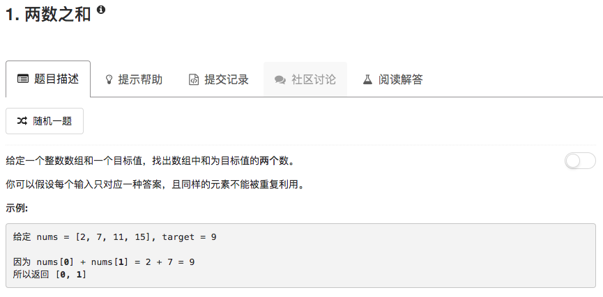

这题目考察的是哈希表的运用。

最简单粗暴的方法就是两层循环解决，但是这样时间复杂度是$O(n^2)$。

运用哈希表，key是nums的元素，value是该元素的标号。循环时，每次先检查当下元素和目标之差是否已经在表中，如果在，就直接返回，不在就按照上面这个规则把元素加入表中。这样的做法时间复杂度是$O(n)$

```python
class Solution(object):
    def twoSum(self, nums, target):
        """
        :type nums: List[int]
        :type target: int
        :rtype: List[int]
        """
        searchTable = {}
        for ii in range(len(nums)):
            compl = target - nums[ii]
            if compl in searchTable.keys():
                ans = [searchTable[compl],ii]
                ans.sort()
                return ans
            
            searchTable[nums[ii]] = ii
            
```

