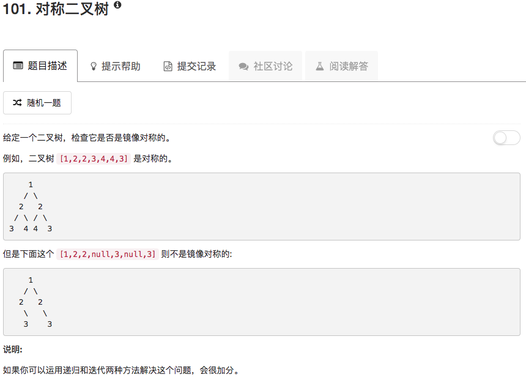

```python
# Definition for a binary tree node.
# class TreeNode(object):
#     def __init__(self, x):
#         self.val = x
#         self.left = None
#         self.right = None

class Solution(object):
    def check(self,P,Q):
        if not P and not Q:
            return True
        if P and Q and P.val == Q.val:
            left = self.check(P.left,Q.right)
            right = self.check(P.right,Q.left)
            return left and right
        return False
        
    def isSymmetric(self, root):
        """
        :type root: TreeNode
        :rtype: bool
        """
        if not root: return True
        
        return self.check(root.left,root.right)
```

