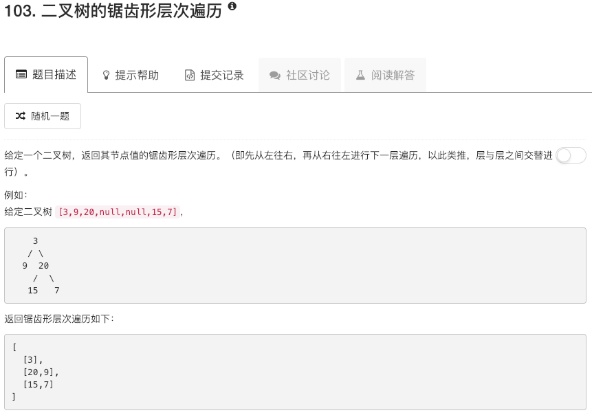

```python
# Definition for a binary tree node.
# class TreeNode:
#     def __init__(self, x):
#         self.val = x
#         self.left = None
#         self.right = None

class Solution:
    def zigzagLevelOrder(self, root):
        """
        :type root: TreeNode
        :rtype: List[List[int]]
        """
        if not root: return []
        
        queue = [root]
        flag = False
        ans = []
        while queue:
            nodes = []
            nodevalue = []
            for node in queue:
                if node.left: nodes.append(node.left)
                if node.right: nodes.append(node.right)
                nodevalue.append(node.val)
            if flag:
                nodevalue.reverse()
                
            ans.append(nodevalue)
            flag = not flag
            queue = nodes
        return ans
```

