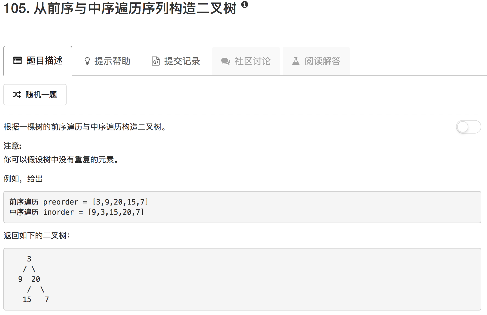

```python
# Definition for a binary tree node.
# class TreeNode(object):
#     def __init__(self, x):
#         self.val = x
#         self.left = None
#         self.right = None

class Solution(object):
    def buildTree(self, preorder, inorder):
        """
        :type preorder: List[int]
        :type inorder: List[int]
        :rtype: TreeNode
        """
        if not preorder or not inorder: return None
        
        tree = TreeNode(preorder[0])
        
        rootIdx_inorder = inorder.index(preorder[0])
        print(preorder[0])
        
        if rootIdx_inorder == 0:
            tree.left = None
            tree.right = self.buildTree(preorder[1:], inorder[rootIdx_inorder+1:])
        elif rootIdx_inorder == len(inorder) - 1:
            tree.right = None
            tree.left = self.buildTree(preorder[1:], inorder[:rootIdx_inorder])
        else:
            tree.right = self.buildTree(preorder[rootIdx_inorder+1:], inorder[rootIdx_inorder+1:])
            tree.left = self.buildTree(preorder[1:rootIdx_inorder+1], inorder[:rootIdx_inorder])
            
        return tree
```

