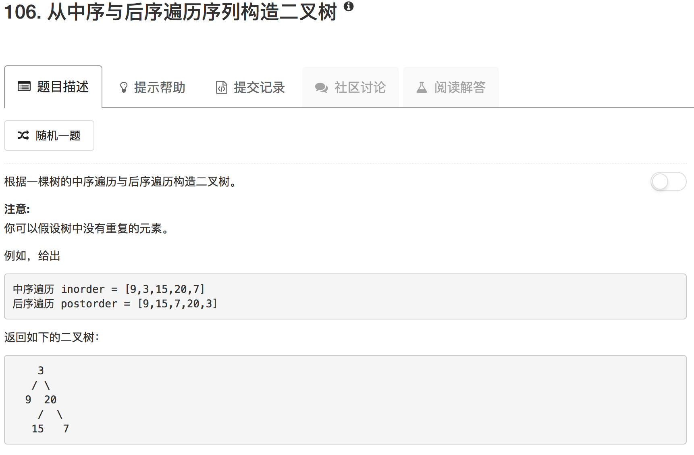

```python
# Definition for a binary tree node.
# class TreeNode(object):
#     def __init__(self, x):
#         self.val = x
#         self.left = None
#         self.right = None

class Solution(object):
    def buildTree(self, inorder, postorder):
        """
        :type inorder: List[int]
        :type postorder: List[int]
        :rtype: TreeNode
        """
        if not inorder or not postorder:
            return None
        
        tree = TreeNode(postorder[-1])
        
        rootIdx_inorder = inorder.index(postorder[-1])
        
        if rootIdx_inorder == 0:
            tree.left = None
            tree.right = self.buildTree(inorder[rootIdx_inorder+1:],postorder[:-1])
        elif rootIdx_inorder == len(inorder)-1:
            tree.right = None
            tree.left = self.buildTree(inorder[:len(inorder)-1],postorder[:-1])
        else:
            len_right = len(inorder[rootIdx_inorder+1:])
            tree.right = self.buildTree(inorder[rootIdx_inorder+1:],postorder[-1-len_right:-1])
            tree.left = self.buildTree(inorder[:rootIdx_inorder],postorder[:-1-len_right])
            
        return tree
```

