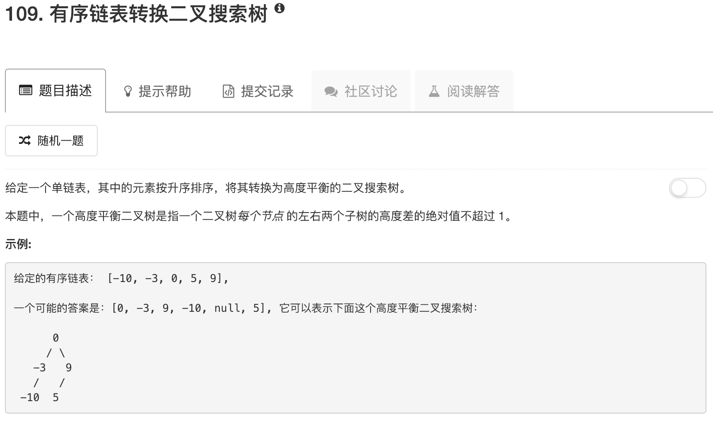

```python
# Definition for singly-linked list.
# class ListNode:
#     def __init__(self, x):
#         self.val = x
#         self.next = None

# Definition for a binary tree node.
# class TreeNode:
#     def __init__(self, x):
#         self.val = x
#         self.left = None
#         self.right = None

class Solution:
    def sortedListToBST(self, head):
        """
        :type head: ListNode
        :rtype: TreeNode
        """
        if not head: return 
        if not head.next: return TreeNode(head.val)
        fast = head
        slow = head
        last = head
        while fast and fast.next:
            last = slow
            slow = slow.next
            fast = fast.next.next
        last.next = None
        fast = slow.next
        
        root = TreeNode(slow.val)
        if slow != head: root.left = self.sortedListToBST(head)
        root.right = self.sortedListToBST(fast)
        return root
```

当然，这道题还有另一种解法。就是先遍历链表变成有序数组，然后按108题的方法建立二叉树。。。