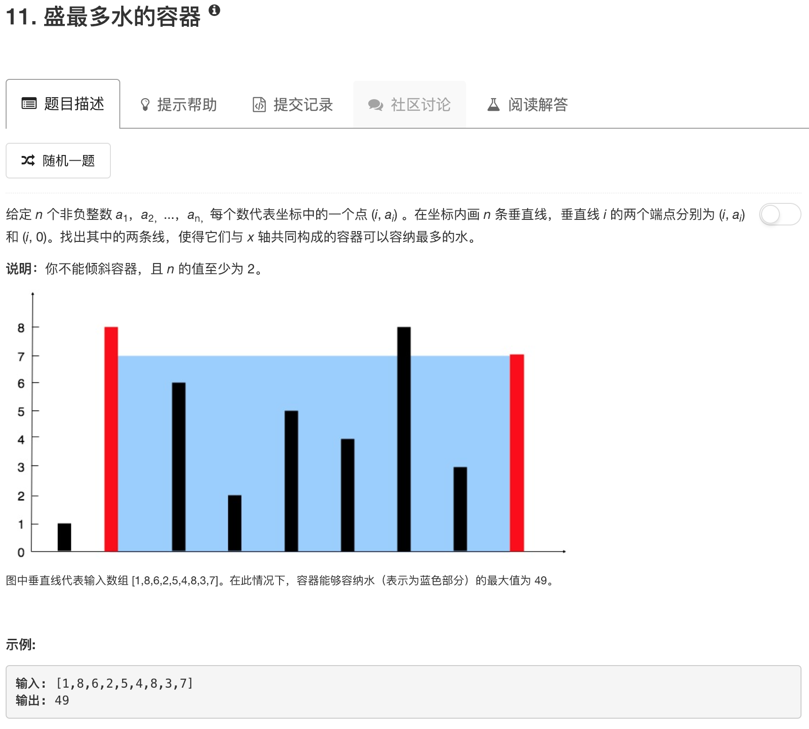

```python
class Solution:
    def maxArea(self, height):
        """
        :type height: List[int]
        :rtype: int
        """
        ans = 0
        left = 0 
        right = len(height)-1
        while left < right:
            tmp = min(height[left],height[right]) * abs(left-right)
            ans = tmp if ans < tmp else ans
            if height[left] < height[right]:
                left += 1
            else:
                right -= 1
        
        return ans
```

