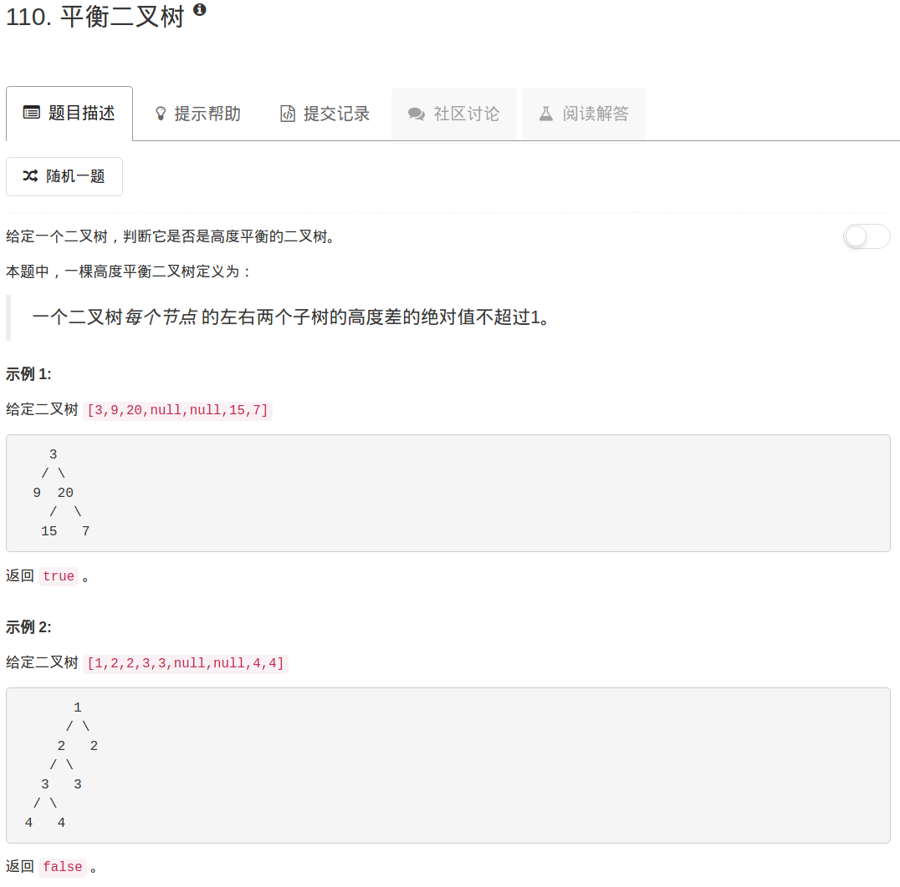

```python
# Definition for a binary tree node.
# class TreeNode:
#     def __init__(self, x):
#         self.val = x
#         self.left = None
#         self.right = None

class Solution:
    def depth(self, root, flag):
        if not root: return 0
        
        left = self.depth(root.left, flag)
        right = self.depth(root.right, flag)
      
        if abs(left-right)>1: flag[0] = True
        
        return max(left, right)+1
    
    def isBalanced(self, root):
        """
        :type root: TreeNode
        :rtype: bool
        """
        flag = [False]
        tmp = self.depth(root, flag)
        return False if flag[0] else True
```

