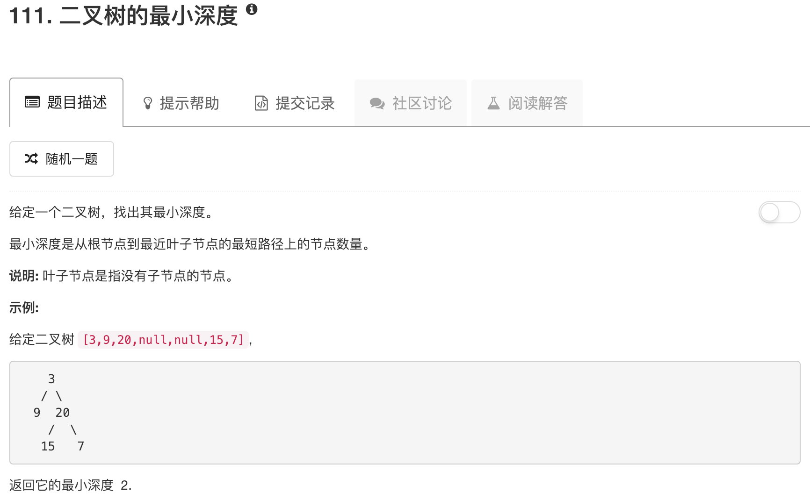

```python
# Definition for a binary tree node.
# class TreeNode:
#     def __init__(self, x):
#         self.val = x
#         self.left = None
#         self.right = None

class Solution:
    def minDepth(self, root):
        """
        :type root: TreeNode
        :rtype: int
        """
        if not root: return 0
        
        left = self.minDepth(root.left)
        right = self.minDepth(root.right)
        
        if left!=0 and right!=0: 
            return min(left,right)+1
        elif left==0 and right!=0:
            return right+1
        elif right==0 and left!=0:
            return left+1
        else:
            return 1
```

