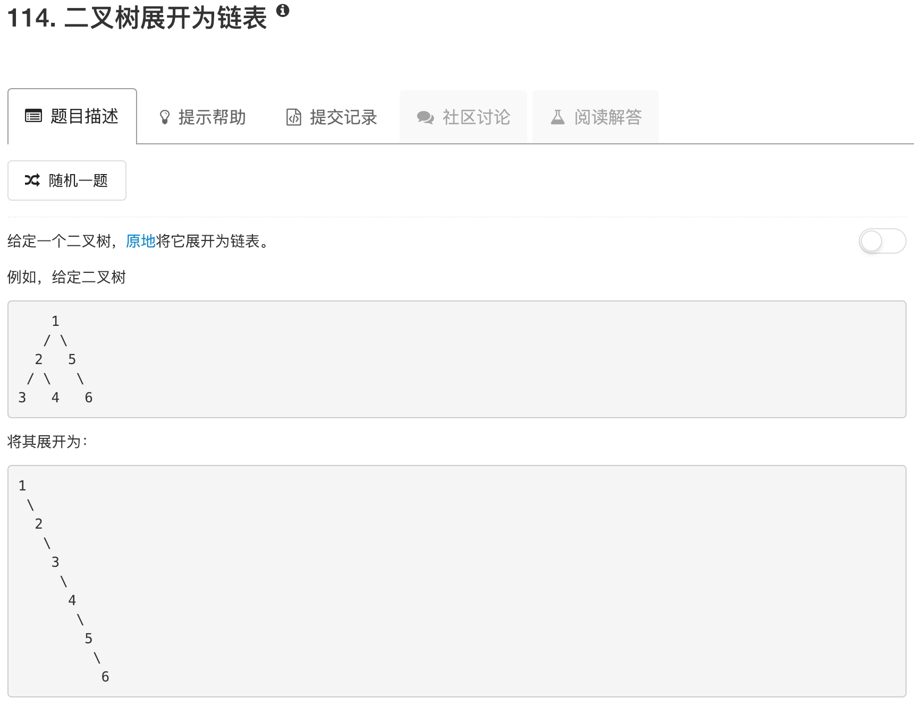

```python
# Definition for a binary tree node.
# class TreeNode:
#     def __init__(self, x):
#         self.val = x
#         self.left = None
#         self.right = None

class Solution:
    def flatten(self, root):
        """
        :type root: TreeNode
        :rtype: void Do not return anything, modify root in-place instead.
        """
        if not root: return 
        
        if root.left: self.flatten(root.left)
        if root.right: self.flatten(root.right)
        
        if root.left:
            tmp = root.left
            while tmp.right:
                tmp = tmp.right
            tmp.right = root.right
            root.right = root.left 
            root.left = None
```

