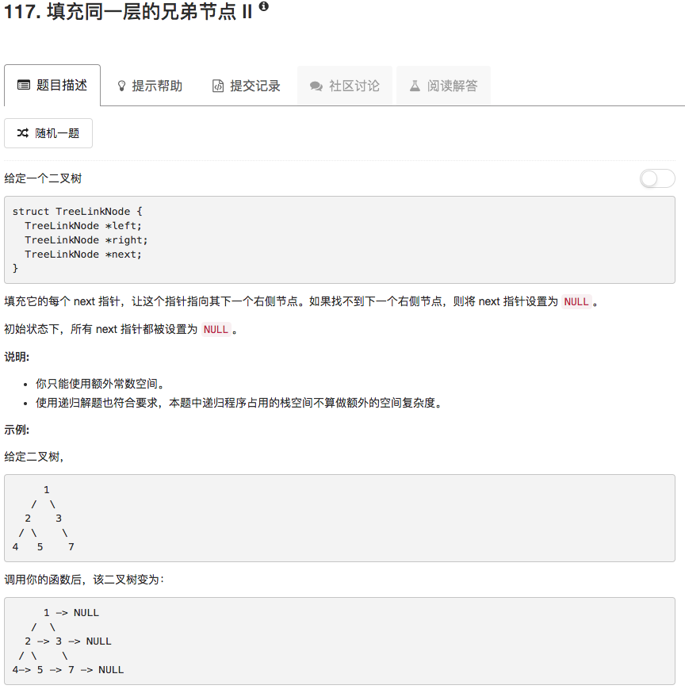

```python
# Definition for binary tree with next pointer.
# class TreeLinkNode:
#     def __init__(self, x):
#         self.val = x
#         self.left = None
#         self.right = None
#         self.next = None

class Solution:
    # @param root, a tree link node
    # @return nothing
    def connect(self, root):
        if not root: return 
        
        queue = [root]
        while queue:
            nodes = []
            for ii in range(len(queue)):
                if queue[ii].left: nodes.append(queue[ii].left)
                if queue[ii].right: nodes.append(queue[ii].right)
                queue[ii].next = queue[ii+1] if ii != len(queue)-1 else None
            
            queue = nodes                
```

