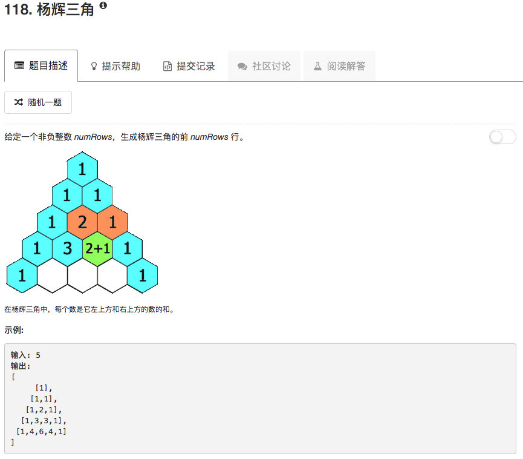

```python
class Solution(object):
    def generate(self, numRows):
        """
        :type numRows: int
        :rtype: List[List[int]]
        """
        ans = []
        for ii in range(numRows):
            tmp = [1] * (ii+1)
            for jj in range(1,len(tmp)-1):
                tmp[jj] = ans[-1][jj] + ans[-1][jj-1]
            ans.append(tmp)
        return ans
```

