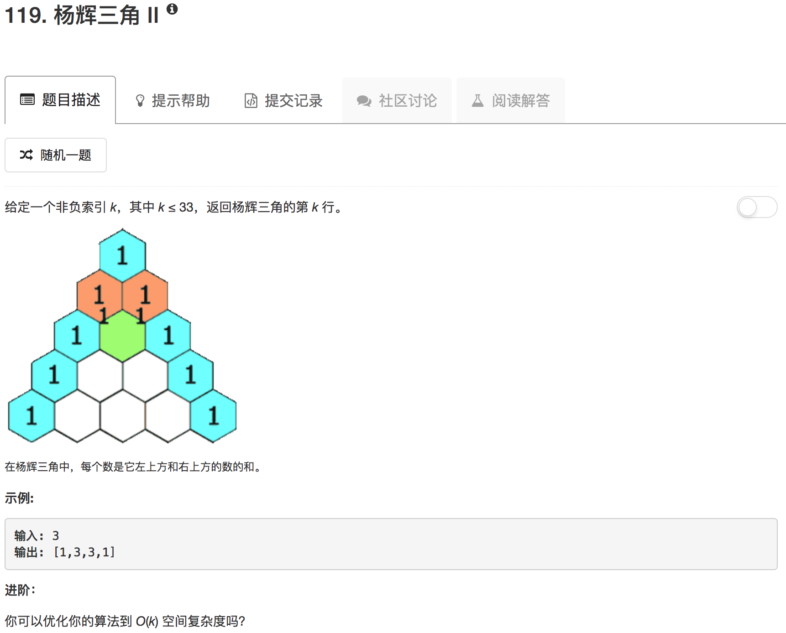

```python
class Solution(object):
    def getRow(self, rowIndex):
        """
        :type rowIndex: int
        :rtype: List[int]
        """
        if rowIndex <= 0: return [1]
        
        ans = [1]
        for ii in range(rowIndex):
            ans = [1] + [ans[i]+ans[i+1] for i in range(len(ans)-1)] + [1]
        return ans
```

