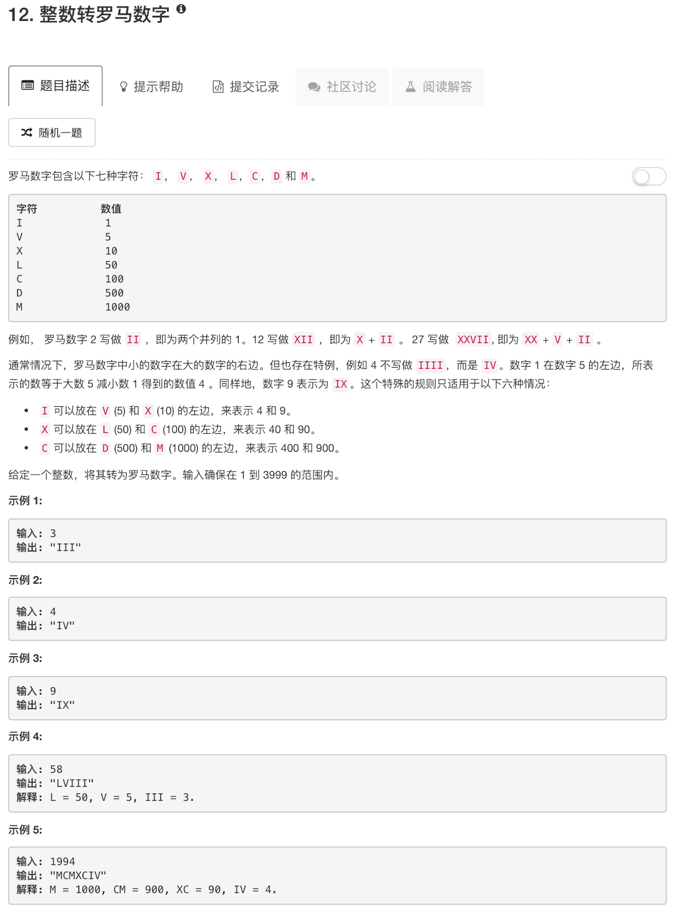

```python
class Solution:
    def intToRoman(self, num):
        """
        :type num: int
        :rtype: str
        """
        nums = [1000, 900, 500, 400, 100, 90, 50, 40, 10, 9, 5, 4, 1]
        chars = ["M", "CM", "D", "CD", "C", "XC", "L", "XL", "X", "IX", "V", "IV", "I"]
        ans = ""
        for ii in range(len(nums)):
            while num >= nums[ii]:
                num = num - nums[ii]
                ans = ans + chars[ii]
        return ans
```

