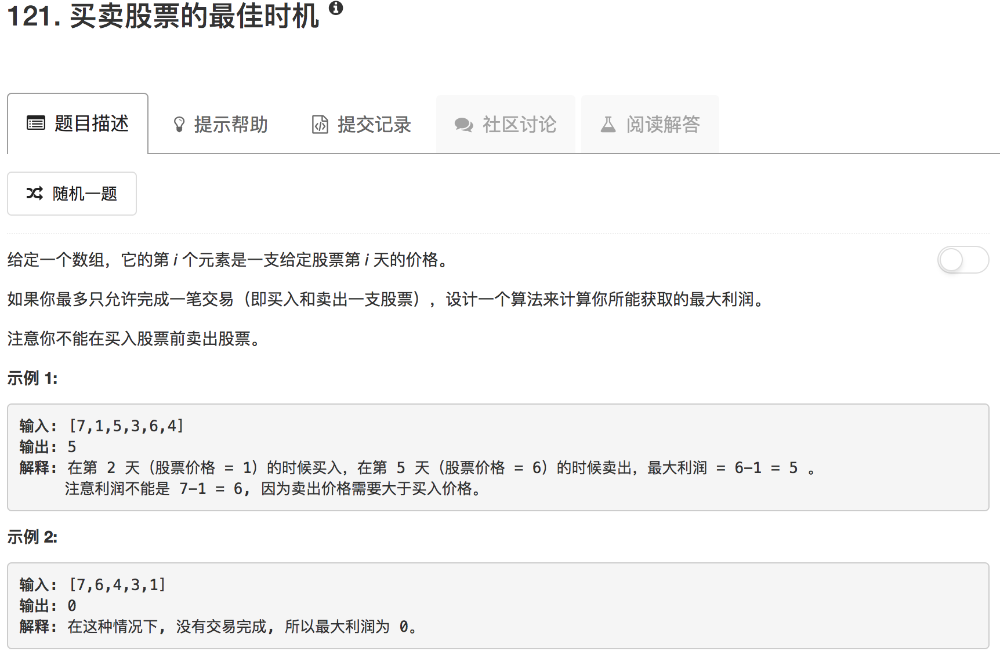

分治法直接求解

```python
class Solution(object):
    def maxCrossarray(self, variance, low, mid, high):
        sum = 0
        leftMax = 0
        leftIdx = 0
        for ii in range(mid, low-1, -1):
            sum = sum + variance[ii]
            if sum > leftMax:
                leftMax = sum
                leftIdx = ii
        sum = 0
        rightMax = 0
        rightIdx = 0
        for ii in range(mid+1,high+1):
            sum = sum + variance[ii]
            if sum > rightMax:
                rightMax = sum
                rightIdx = ii
        return [leftIdx, rightIdx, leftMax+rightMax]
    
    def maxSubarray(self, variance, low, high):
        if low == high:
            return [low, high, variance[low]]
        else:
            mid = (low + high) // 2
            leftlow, lefthigh, leftMax = self.maxSubarray(variance, low, mid)
            rightlow, righthigh, rightMax = self.maxSubarray(variance, mid+1, high)
            crosslow, crosshigh, crossMax = self.maxCrossarray(variance, low, mid, high)
            if leftMax >= rightMax and leftMax >= crossMax:
                return [leftlow, lefthigh, leftMax]
            elif rightMax >= leftMax and rightMax >= crossMax:
                return [rightlow, righthigh, rightMax]
            else:
                return [crosslow, crosshigh, crossMax]
    
    def maxProfit(self, prices):
        """
        :type prices: List[int]
        :rtype: int
        """
        if not prices: return 0
        if len(prices) == 1: return 0
        variance = [prices[i+1]-prices[i] for i in range(len(prices)-1)]
        print(variance)
        low, high, max = self.maxSubarray(variance, 0, len(variance)-1)
        if max <= 0:
            return 0
        else:
            return max
```

