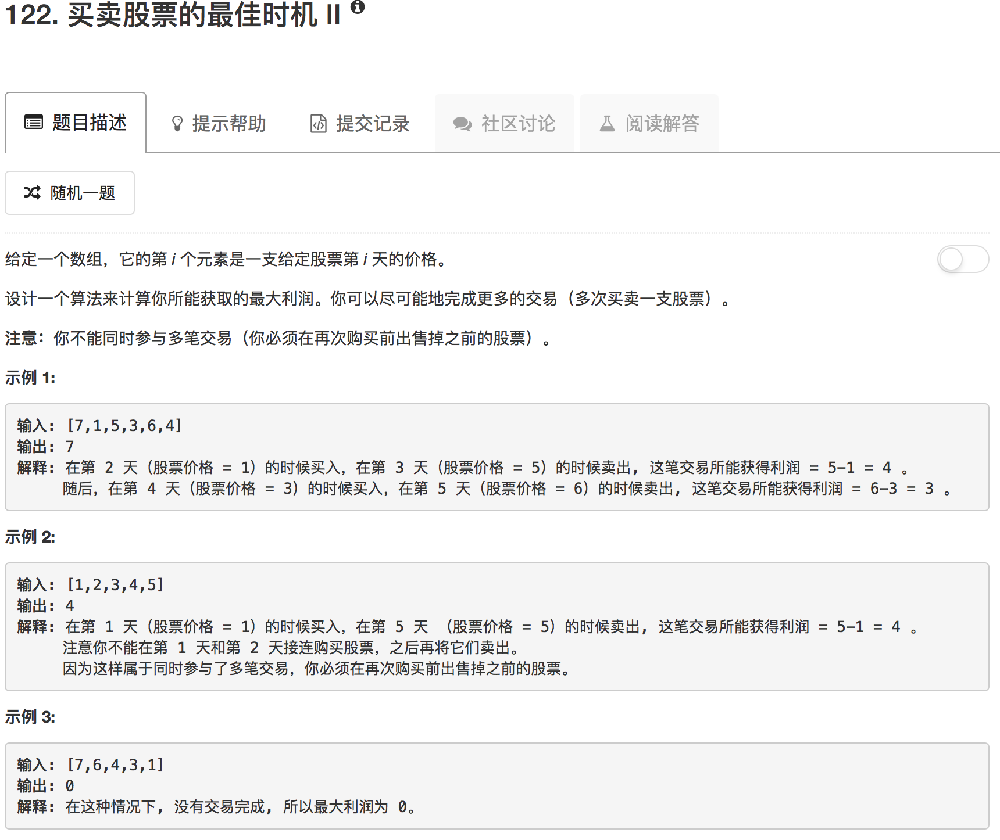

```python
class Solution(object):
    def maxProfit(self, prices):
        """
        :type prices: List[int]
        :rtype: int
        """
        if not prices: return 0
        if len(prices) == 1: return 0
        variance = [prices[i+1]-prices[i] for i in range(len(prices)-1)]
        print(variance)
        sum = 0
        for num in variance:
            if num > 0:
                sum += num
        return sum if sum > 0 else 0
```

