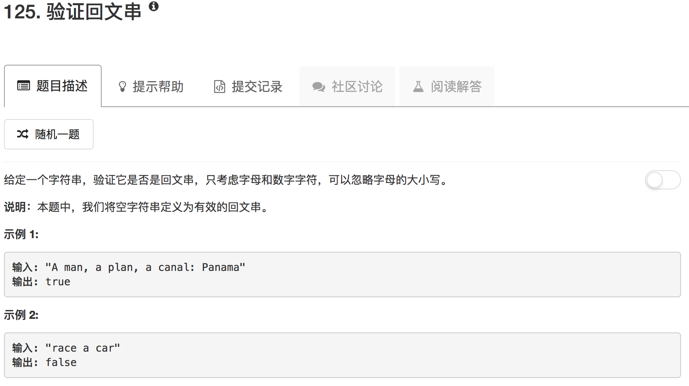

```python
class Solution(object):
    def isPalindrome(self, s):
        """
        :type s: str
        :rtype: bool
        """
        A = []
        B = []
        for ii in range(len(s)):
            if s[ii].isdigit() or s[ii].isalpha():
                A.append(s[ii].lower())
            if s[len(s)-ii-1].isdigit() or s[len(s)-ii-1].isalpha():
                B.append(s[len(s)-ii-1].lower())
        if A == B: return True 
        return False
```

