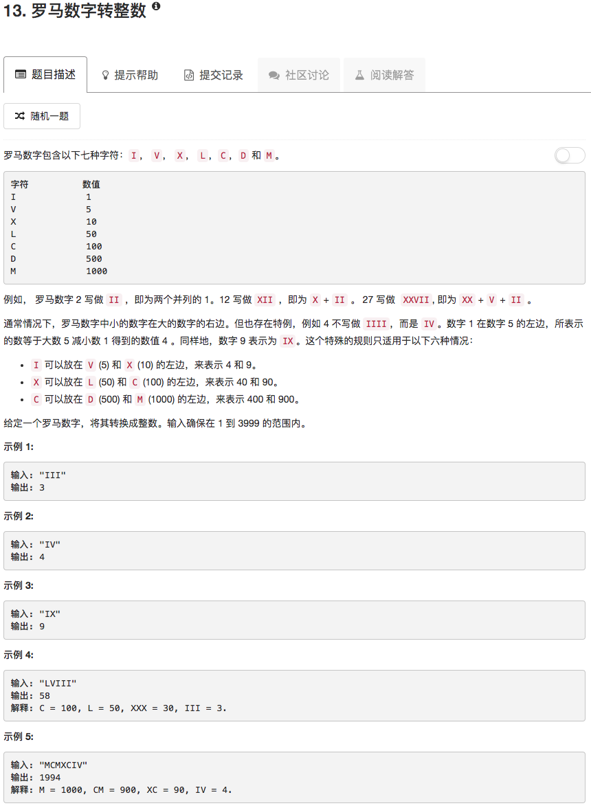

```python
class Solution(object):
    def romanToInt(self, s):
        """
        :type s: str
        :rtype: int
        """
        if not s: return None
        
        sum = 0
        Table = {'I':1,'V':5,'X':10,'L':50,'C':100,'D':500,'M':1000}
        
        if len(s) > 1:
            for ii in range(len(s)-1):
                if (s[ii] == 'I' and s[ii+1] in ['V','X']) or (s[ii] == 'X' and s[ii+1] in ['L','C']) or (s[ii] == 'C' and s[ii+1] in ['D','M']):
                    sum = sum - Table[s[ii]]
                else:
                    sum = sum + Table[s[ii]]
        sum = sum + Table[s[-1]]
        return sum
```

