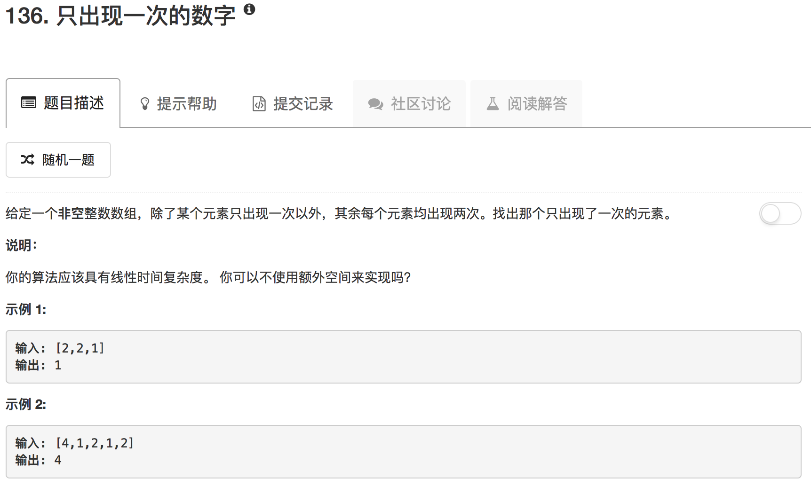

这道题考察的是位运算。如果相同的两个数按位异或，得到的就是0；任何一个数和0按位异或，得到的就是这个数的自身

```python
class Solution(object):
    def singleNumber(self, nums):
        """
        :type nums: List[int]
        :rtype: int
        """
        return reduce(operator.xor, nums)
```

