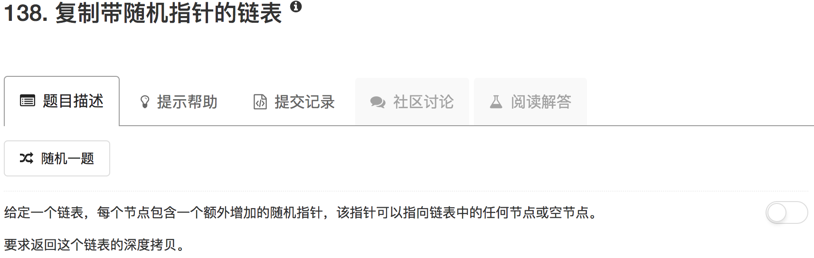

用递归方法解决。考察某个节点，我们已经知道了这个节点的信息，我们可以直接拷贝出这个节点。因此，递归可以采用自顶向下的策略，然后设置一个全局的字典记录已经深拷贝的每个节点。

```python
# Definition for singly-linked list with a random pointer.
# class RandomListNode(object):
#     def __init__(self, x):
#         self.label = x
#         self.next = None
#         self.random = None

class Solution(object):
    def __init__(self):
        self.search = {}
    
    def copyRandomList(self, head):
        """
        :type head: RandomListNode
        :rtype: RandomListNode
        """
        if not head: return None
        
        if head in self.search:
            return self.search[head]
        
        node = RandomListNode(head.label)
        self.search[head] = node
            
        node.next = self.copyRandomList(head.next)
        node.random = self.copyRandomList(head.random)
        return node
```

