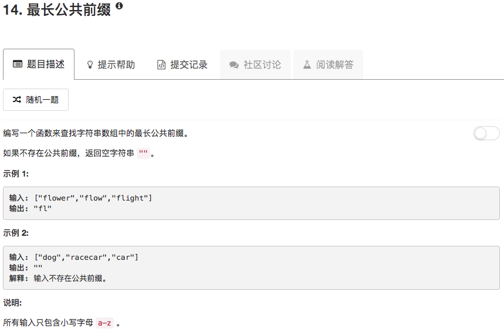

```python
class Solution(object):
    def longestCommonPrefix(self, strs):
        """
        :type strs: List[str]
        :rtype: str
        """
        if not strs: return ""
        
        ans = []
        for ii in range(len(strs[0])):
            for jj in range(1,len(strs)):
                if ii > len(strs[jj])-1 or strs[0][ii] != strs[jj][ii]:
                    return strs[0][0:ii]
        return strs[0]
```