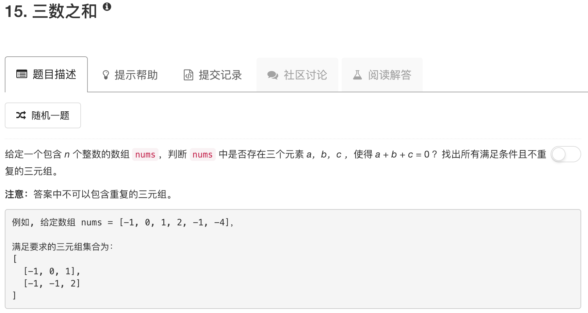

```python
class Solution:
    def threeSum(self, nums):
        """
        :type nums: List[int]
        :rtype: List[List[int]]
        """
        ans = []
        nums.sort()
        for ii in range(len(nums)):
            if nums[ii] > 0: break
            if ii > 0 and nums[ii] == nums[ii-1]: continue
            
            jj = ii + 1
            kk = len(nums) - 1
            
            while jj < kk:
                if nums[jj] + nums[kk] == -nums[ii]:
                    ans.append([nums[ii],nums[jj],nums[kk]])
                    while jj < kk and nums[jj] == nums[jj+1]: jj = jj + 1
                    while jj < kk and nums[kk] == nums[kk-1]: kk = kk - 1
                    jj = jj + 1
                    kk = kk - 1
                elif nums[jj] + nums[kk] < -nums[ii]:
                    jj = jj + 1
                else:
                    kk = kk - 1
        return ans
```

这题和两数之和不太一样。

如果要和为0，那么必然是有正有负，这种情况下，先对数组排序，然后遍历每个数作为三个数中的第一个数。fix第一个数是第一步

如果已经遇到了正数，那么，第一个数为正，后面两数肯定也为正，那么就没啥好做了

如果几个数连续，那么直接跳过，第一个数没必要fix几次

然后就是用两个指针去试。一个从前往后，另一个从后往前

同样，如果第二/三个数有连续几个数重复，直接跳过