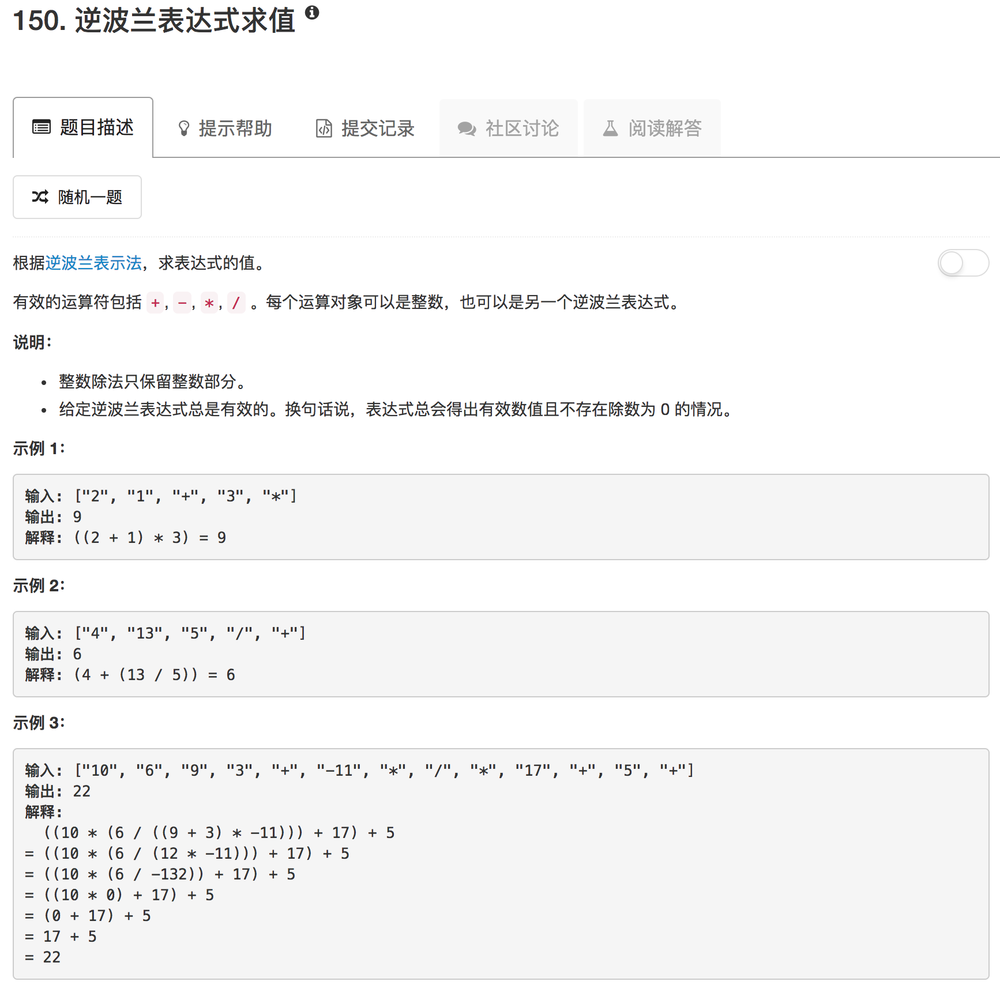

```python
class Solution(object):
    def isNumber(self, char):
        return True if char not in ["+","-","*","/"] else False
    
    def evalRPN(self, tokens):
        """
        :type tokens: List[str]
        :rtype: int
        """
        
        stack = []
        for ii in tokens:
            if self.isNumber(ii): 
                stack.append(int(ii))
            else:
                a = int(stack.pop())
                b = int(stack.pop())
                if ii == "+":
                    stack.append(a+b)
                elif ii == "-":
                    stack.append(b-a)
                elif ii == "*":
                    stack.append(a*b)
                else:
                    res = abs(b) // abs(a)
                    if a*b < 0: res = -res
                    stack.append(res)
        return stack.pop()
```

