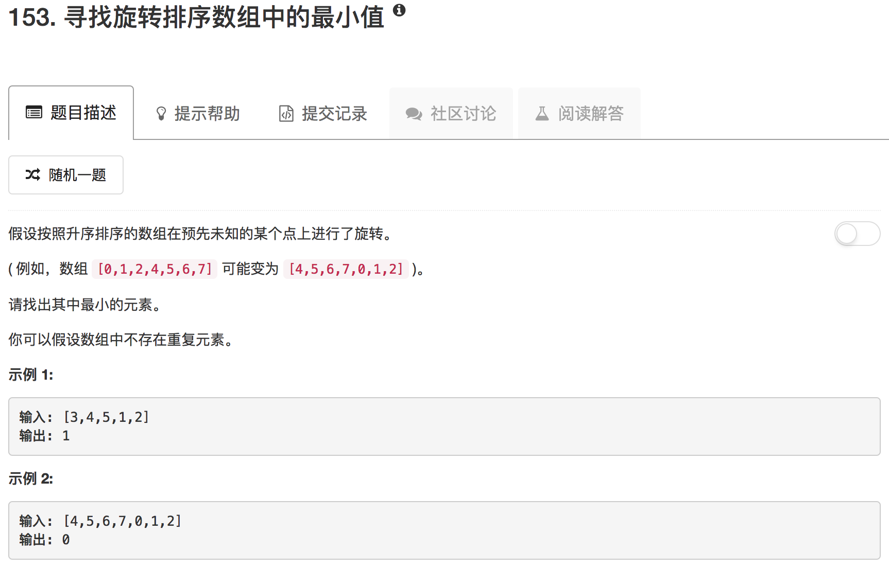

```python
class Solution(object):
    def findMin(self, nums):
        """
        :type nums: List[int]
        :rtype: int
        """
        low = 0
        high = len(nums) - 1
        if nums[0] <= nums[len(nums)-1]: return nums[0]
        while low <= high:
            if low == high: return nums[low]
            mid = (low + high) // 2
            if nums[mid] > nums[high]:
                low = mid + 1
            else:
                high = mid
```

