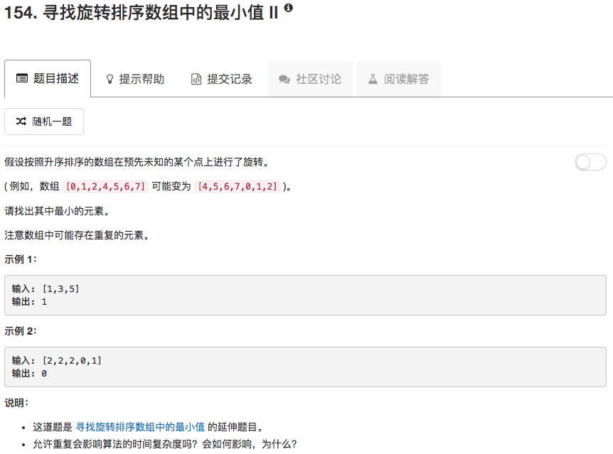

二分查找的延伸题目。首先，对输入数组的分析还是一样的。如果中间值大于右端，那么最小值在中间值和右端之间，left=mid+1；如果中间值小于左端，那么最小值在中间值和左端之间，right=mid。其他情况，如中间值等于右端，中间值小于右端，中间值大于左端等等，都不明确，于是让right减一即可，因为right始终会是大值

```python
class Solution(object):
    def findMin(self, nums):
        """
        :type nums: List[int]
        :rtype: int
        """
        left = 0
        right = len(nums) - 1
        
        while left < right:
            mid = (left + right) // 2
            if nums[mid] > nums[right]:
                left = mid + 1
            elif nums[mid] < nums[left]:
                right = mid
            else:
                right = right - 1
        return nums[left]
```

