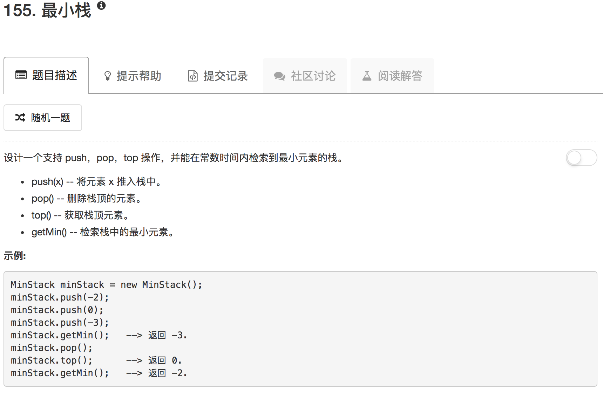

```python
class MinStack(object):

    def __init__(self):
        """
        initialize your data structure here.
        """
        self.array = []
        self.minimum = []

    def push(self, x):
        """
        :type x: int
        :rtype: void
        """
        if len(self.array) == 0:
            self.minimum.append(x)
        if self.minimum[-1] >= x:
            self.minimum.append(x)
        self.array.append(x)

    def pop(self):
        """
        :rtype: void
        """
        if len(self.array) == 0: return None
        top = self.array.pop()
        if top == self.minimum[-1]:
            self.minimum.pop()

    def top(self):
        """
        :rtype: int
        """
        if len(self.array) == 0: return None
        return self.array[-1]

    def getMin(self):
        """
        :rtype: int
        """
        if len(self.minimum) == 0: return None
        return self.minimum[-1]


# Your MinStack object will be instantiated and called as such:
# obj = MinStack()
# obj.push(x)
# obj.pop()
# param_3 = obj.top()
# param_4 = obj.getMin()
```

