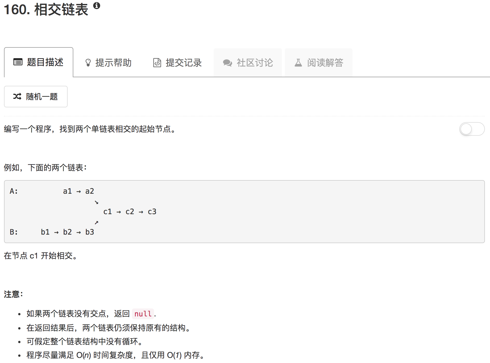

```python
# Definition for singly-linked list.
# class ListNode(object):
#     def __init__(self, x):
#         self.val = x
#         self.next = None

class Solution(object):
    def hasSameEnd(self, p1, p2):
        lenP1 = 0
        lenP2 = 0
        
        while p1.next:
            p1 = p1.next
            lenP1 += 1
        
        while p2.next:
            p2 = p2.next
            lenP2 += 1
        
        flag = True if p1 == p2 else False
        
        return flag, lenP1, lenP2
        
    
    def getIntersectionNode(self, headA, headB):
        """
        :type head1, head1: ListNode
        :rtype: ListNode
        """
        if not headA or not headB: return None
        
        P1 = headA
        P2 = headB
        flag, lenP1, lenP2 = self.hasSameEnd(P1, P2)
        
        if not flag: return None
        
        (diff, longer) = (lenP1 - lenP2, "headA") if lenP1 > lenP2 else (lenP2 - lenP1, "headB")
        
        while diff:
            if longer == "headA":
                headA = headA.next
                diff -= 1
            else:
                headB = headB.next
                diff -= 1
        
        while headA and headB:
            if headA == headB:
                return headA
            else:
                headA = headA.next
                headB = headB.next
        return None
```

