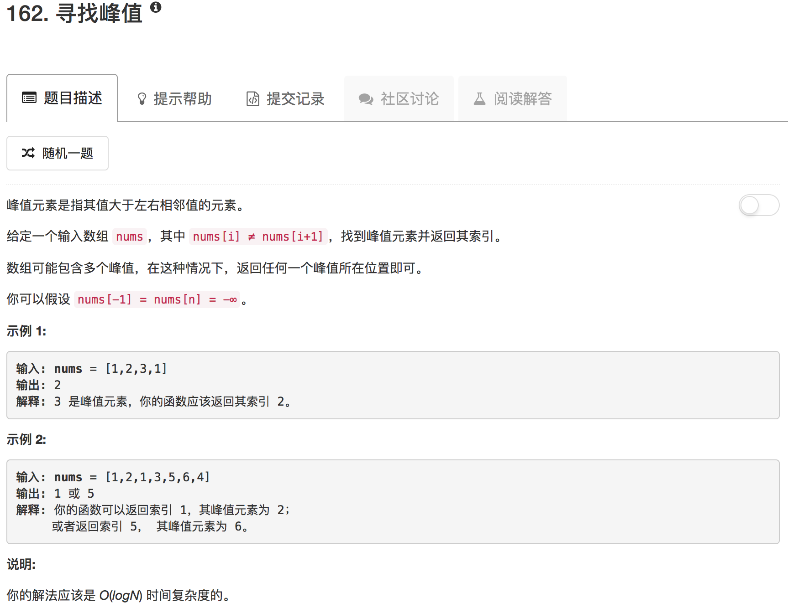

如果中间元素大于其相邻后续元素，则中间元素左侧(包含该中间元素）必包含一个局部最大值。如果中间元素小于其相邻后续元素，则中间元素右侧必包含一个局部最大值。

```python
class Solution(object):
    def findPeakElement(self, nums):
        """
        :type nums: List[int]
        :rtype: int
        """
        if not nums: return -1
        
        low = 0
        high = len(nums)-1
        
        while low <= high:
            if low == high: return low
            
            mid = low + (high - low) // 2
            
            if nums[mid] < nums[mid+1]:
                low = mid + 1
            else:
                high = mid
```

