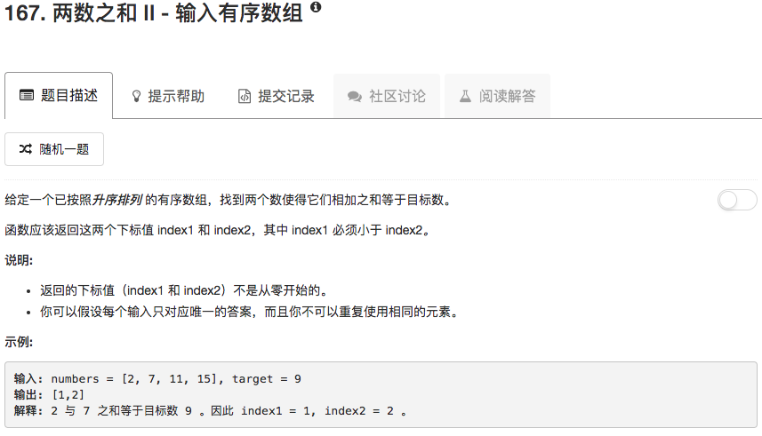

```python
class Solution(object):
    def twoSum(self, numbers, target):
        """
        :type numbers: List[int]
        :type target: int
        :rtype: List[int]
        """
        search = {}
        for ii in range(len(numbers)):
            comp = target - numbers[ii]
            if comp in search.keys():
                ans = [ii+1, search[comp]+1]
                ans.sort()
                return ans
            search[numbers[ii]] = ii
        return []
```

