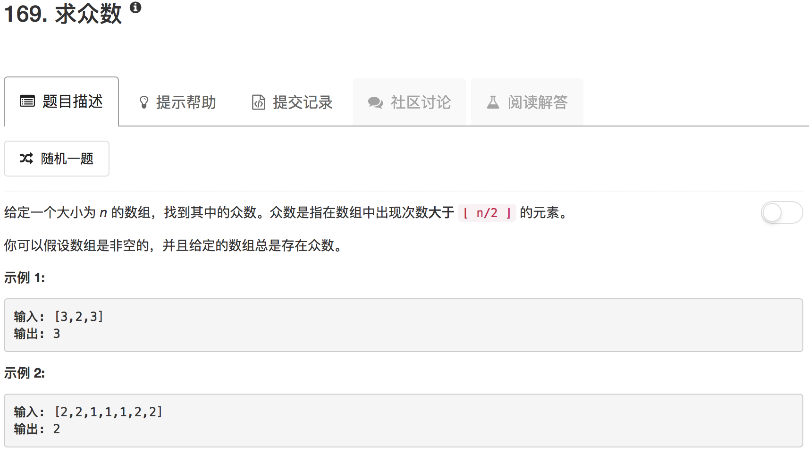

```python
class Solution(object):
    def majorityElement(self, nums):
        """
        :type nums: List[int]
        :rtype: int
        """
        searchTable = {}
        ans = 0
        for num in nums:
            if num in searchTable:
                searchTable[num] = searchTable[num] + 1
            else:
                searchTable[num] = 1
            
            if searchTable[num] > len(nums)//2:
                ans = num
        return ans
```

