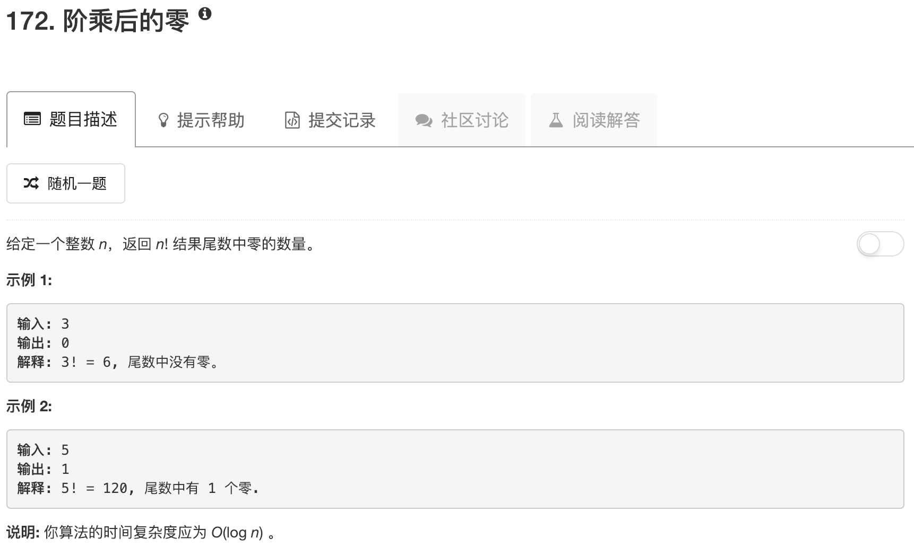

```python
class Solution:
    def trailingZeroes(self, n):
        """
        :type n: int
        :rtype: int
        """
        ans = 0
        while n:
            n = n // 5
            ans = ans + n
        return ans
```

如果末端包含0，那么一定可以表达为：
$$
n = x^i10^k=x^i2^k5^k
$$
只要数5的个数就行了