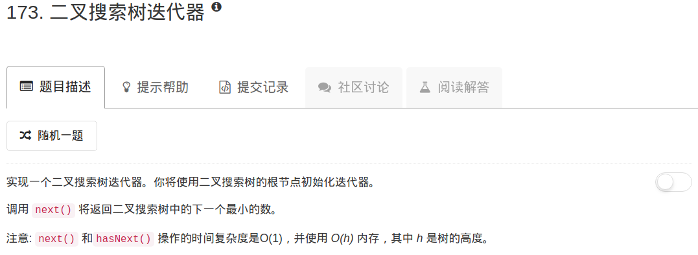

​

```python
# Definition for a  binary tree node
# class TreeNode(object):
#     def __init__(self, x):
#         self.val = x
#         self.left = None
#         self.right = None

class BSTIterator(object):
    def __init__(self, root):
        """
        :type root: TreeNode
        """
        self.stack = []
        cur = root
        while cur:
            self.stack.append(cur)
            cur = cur.left

    def hasNext(self):
        """
        :rtype: bool
        """
        return not self.stack == []
        

    def next(self):
        """
        :rtype: int
        """
        nextv = self.stack.pop()
        cur = nextv.right
        while cur:
            self.stack.append(cur)
            cur = cur.left
        return nextv.val
        

# Your BSTIterator will be called like this:
# i, v = BSTIterator(root), []
# while i.hasNext(): v.append(i.next())
```

