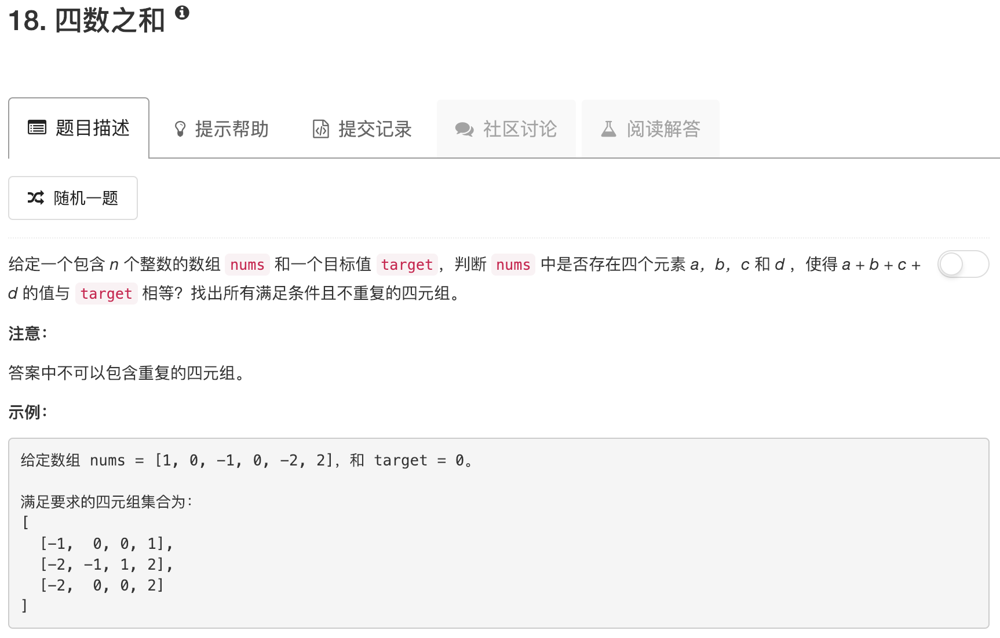

```python
class Solution:
    def fourSum(self, nums, target):
        """
        :type nums: List[int]
        :type target: int
        :rtype: List[List[int]]
        """
        nums.sort()
        n = len(nums)
        ans = []
        for ii in range(n):
            if ii > 0 and nums[ii] == nums[ii-1]: continue
            
            for jj in range(ii+1,n-2):
                if jj > ii+1 and nums[jj] == nums[jj-1]: continue
                kk = jj + 1
                ll = n - 1
                while kk < ll:
                    if nums[ii] + nums[jj] + nums[kk] + nums[ll] == target:
                        ans.append([nums[ii],nums[jj],nums[kk],nums[ll]])
                        while kk < ll and nums[kk] == nums[kk+1]: kk += 1
                        while kk < ll and nums[ll] == nums[ll-1]: ll -= 1
                        kk += 1
                        ll -= 1
                    elif nums[ii] + nums[jj] + nums[kk] + nums[ll] < target:
                        kk += 1
                    else:
                        ll -= 1
        return ans             
```

其实就是15.三数之和的变形。。。