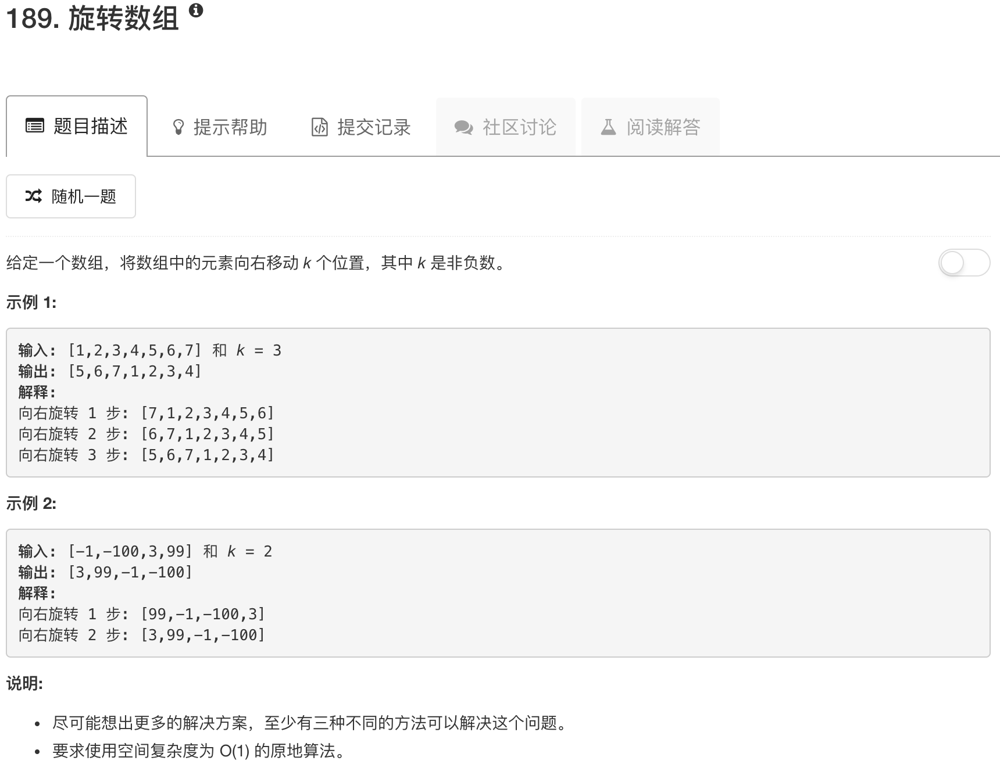

```python
class Solution(object):
    def rotate(self, nums, k):
        """
        :type nums: List[int]
        :type k: int
        :rtype: void Do not return anything, modify nums in-place instead.
        """
        for ii in range(k):
            num = nums.pop()
            nums.insert(0,num)
```

