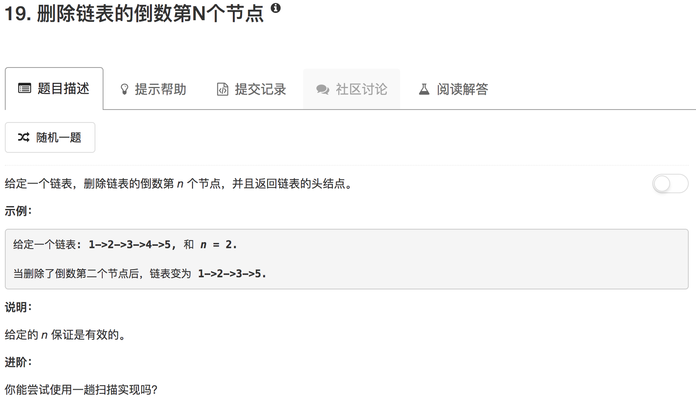

```python
# Definition for singly-linked list.
# class ListNode(object):
#     def __init__(self, x):
#         self.val = x
#         self.next = None

class Solution(object):
    def delete(self, node):
        if not node.next.next:
            node.next = None
        else:
            node.next = node.next.next
            
    def removeNthFromEnd(self, head, n):
        """
        :type head: ListNode
        :type n: int
        :rtype: ListNode
        """
        fast = head
        slow = head
        
        while n:
            fast = fast.next
            n -= 1
        
        if not fast:
            return slow.next if slow.next else None
        
        while fast.next:
            fast = fast.next
            slow = slow.next
        
        self.delete(slow)
        
        return head
```

