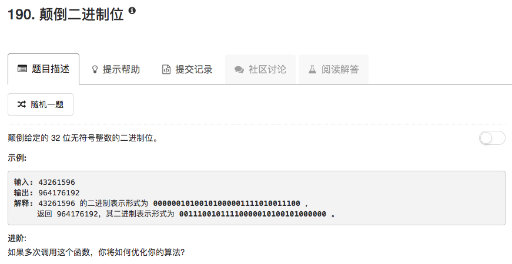

这里考察的是位运算。

获取最后一位数字可以使用“&”运算符，在二进制下，只有1和1做&才能得到1，否则为0，这样就取得了最后一位

在数字末尾直接增加一位，可以先将数字左移，然后通过“|”运算符把最后一位加上。在二进制下，左移后必然为0，然后|运算时，只有0和0做|才能得到0，否则为1

```python
class Solution:
    # @param n, an integer
    # @return an integer
    def reverseBits(self, n):
        ans = 0 
        for ii in range(32):
            last = n & 0x01
            n = n >> 1
            
            ans = ans << 1
            ans = ans | last
            
        if n != 0:
            return "The input is not an unsigned 32 bit integer"
            
        return ans
```

