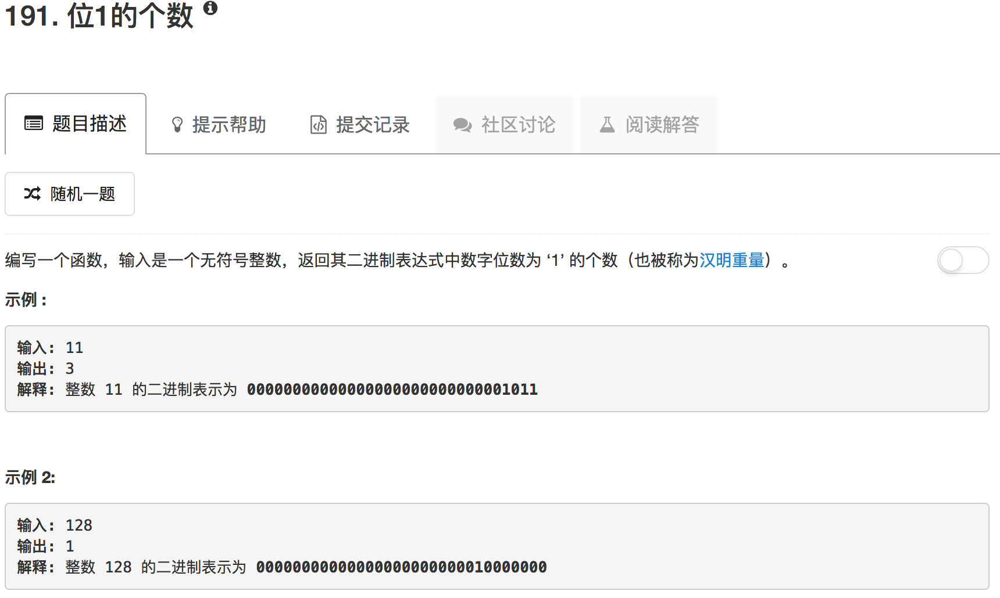

```python
class Solution(object):
    def hammingWeight(self, n):
        """
        :type n: int
        :rtype: int
        """
        sum = 0
        while n:
            sum = sum + (n & 1)
            n = n >> 1
        return sum
```

