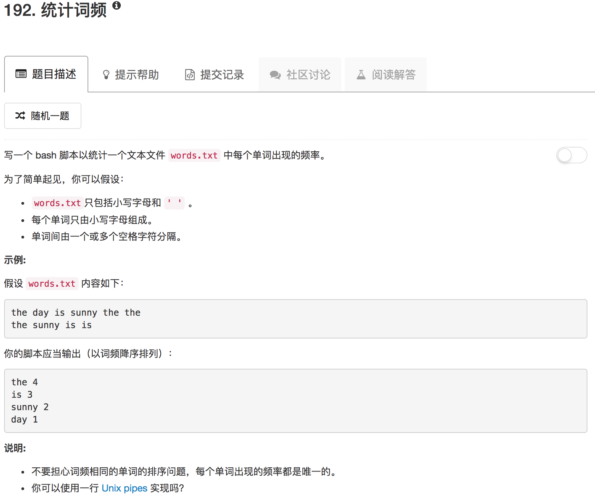

```shell
# Read from the file words.txt and output the word frequency list to stdout.
grep -E -o "\b[[:alpha:]]+\b" words.txt | awk '{array[$1]++} END {for(key in array) print key,array[key]}' | sort -nr -k 2
```

