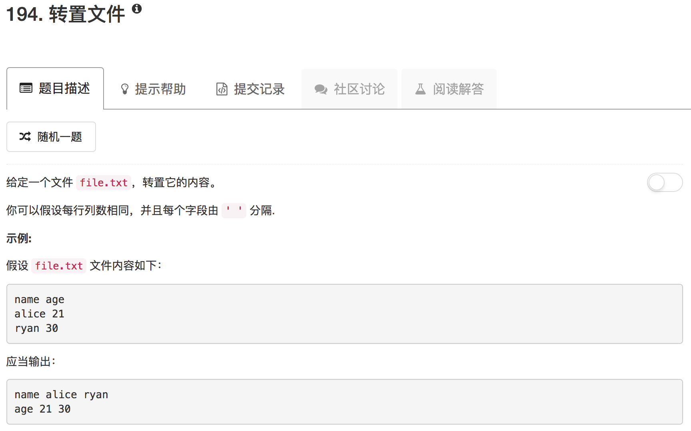

```shell
# Read from the file file.txt and print its transposed content to stdout.
awk '{for(i=1;i<=NF;i++){if(NR==1){data[i]=$i}else{data[i]=data[i]" "$i}}}END{for(i=1;i<=NF;i++){printf("%s\n",data[i])}}' file.txt
```

