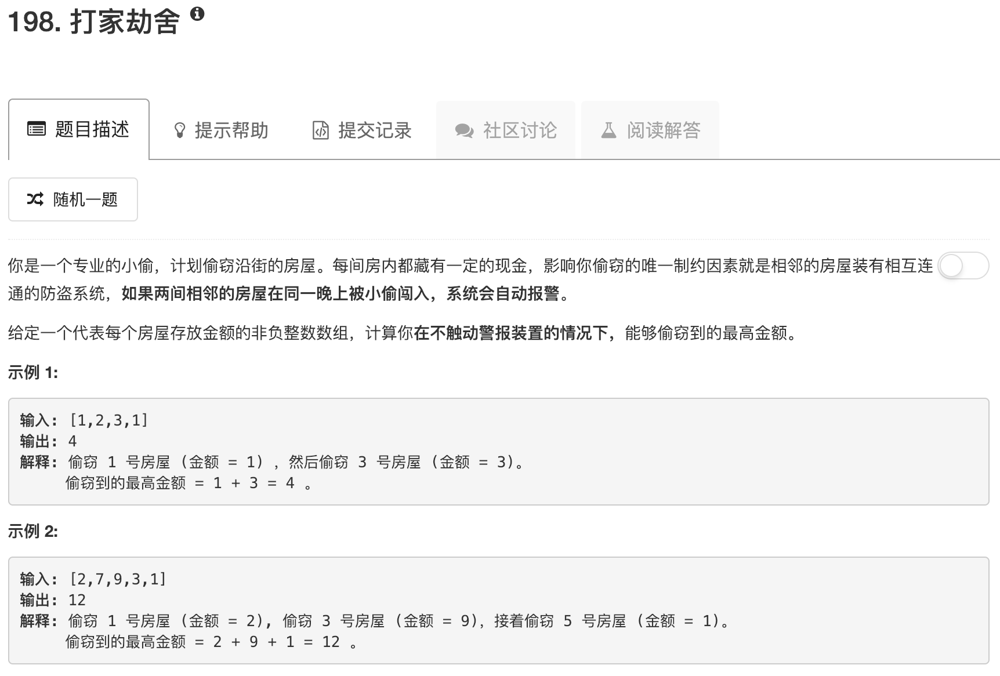

```python
class Solution:
    def rob(self, nums):
        """
        :type nums: List[int]
        :rtype: int
        """
        if not nums: return 0
        if len(nums) <= 1: return nums[0]
        
        dp = [nums[0],max(nums[0],nums[1])]
        for ii in range(2,len(nums)):
            dp.append(max(nums[ii]+dp[ii-2],dp[ii-1]))
        return dp[len(nums)-1]
```

