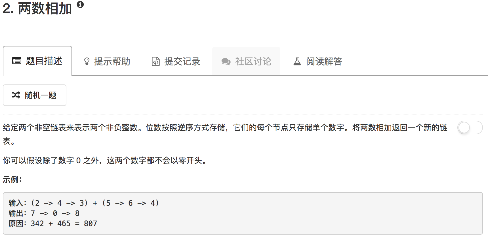

```python
# Definition for singly-linked list.
# class ListNode(object):
#     def __init__(self, x):
#         self.val = x
#         self.next = None

class Solution(object):
    def addTwoNumbers(self, l1, l2):
        """
        :type l1: ListNode
        :type l2: ListNode
        :rtype: ListNode
        """
        tmp = ListNode(0)
        ans = tmp
        carry = 0
        while l1 or l2:
            l1num = l1.val if l1 else 0
            l2num = l2.val if l2 else 0
            sum = l1num + l2num + carry
            carry = sum // 10
            sum = sum if sum < 10 else sum % 10
            tmp.next = ListNode(sum)
            tmp = tmp.next
            l1 = l1.next if l1 else None
            l2 = l2.next if l2 else None
        
        if carry: tmp.next = ListNode(1)
        
        return ans.next   
```

