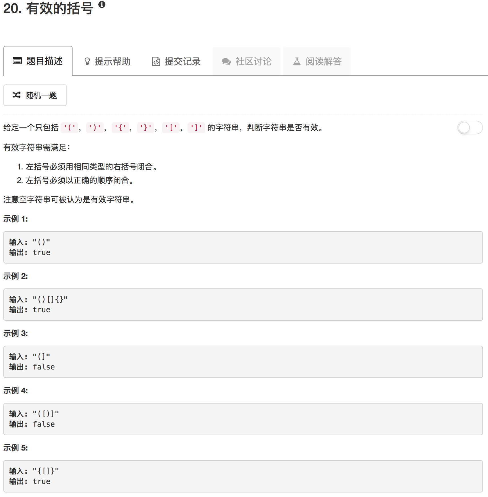

```python
class Solution(object):
    def isValid(self, s):
        """
        :type s: str
        :rtype: bool
        """
        charTable = []
        for char in s:
            if char in ["(", "{", "["]:
                charTable.append(char)
            if char in [")", "}", "]"]:
                if not charTable: return False
                tmp = charTable.pop()
                if not (tmp == "(" and char == ")") and not (tmp == "[" and char == "]") and not (tmp == "{" and char == "}"): return False
        if charTable: return False
        return True
```

