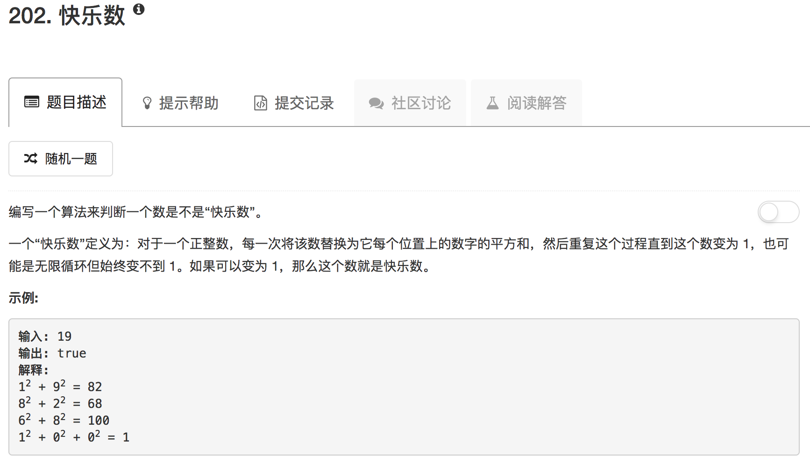

如果某数为快乐数，那么最后就是1不断循环。如果某数不是快乐数，那么就是某个数一直循环

```python
class Solution(object):
    def addDigit(self,n):
        sum = 0
        while n:
            sum = sum + (n % 10)**2
            n = n // 10
        return sum
        
    def isHappy(self, n):
        """
        :type n: int
        :rtype: bool
        """
        search = []
        while True:
            n = self.addDigit(n)
            if n in search:
                return True if n == 1 else False
            else:
                search.append(n)
```

