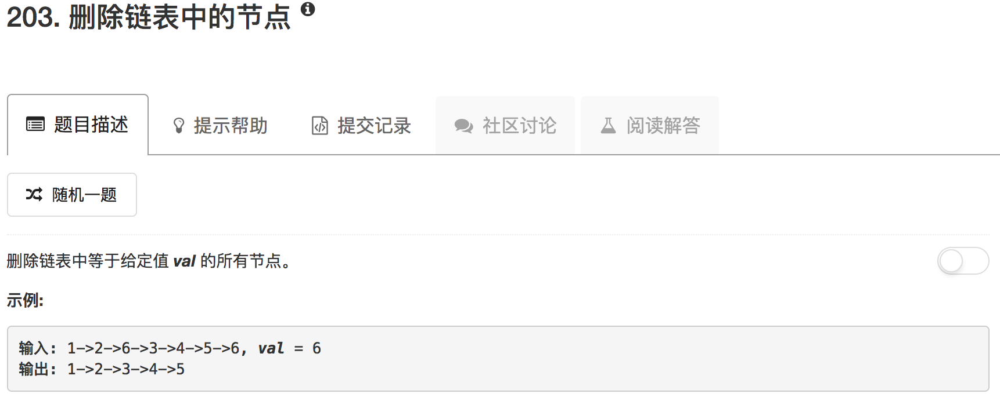

```python
# Definition for singly-linked list.
# class ListNode(object):
#     def __init__(self, x):
#         self.val = x
#         self.next = None

class Solution(object):
    def removeElements(self, head, val):
        """
        :type head: ListNode
        :type val: int
        :rtype: ListNode
        """
        if not head: return []
        fast = head
        slow = head
        fast = fast.next
        while fast:
            if fast.val == val:
                slow.next = fast.next
                fast = fast.next
                continue
            slow = slow.next
            fast = fast.next
        if head.val == val:
            head = head.next
        return head
```

