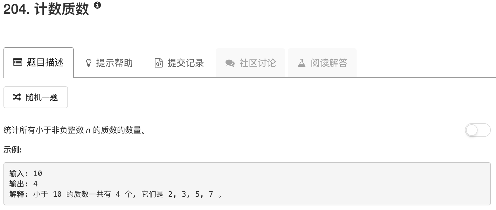

```python
class Solution:
    def countPrimes(self, n):
        """
        :type n: int
        :rtype: int
        """
        if n <= 2: return 0
        table = [True]*(n)
        for ii in range(2,n):
            if table[ii]:
                table[ii::ii] = [False]*len(table[ii::ii])
                table[ii] = True
        ans = 0
        for ii in range(2,n):
            if table[ii]: ans += 1
        return ans
```

