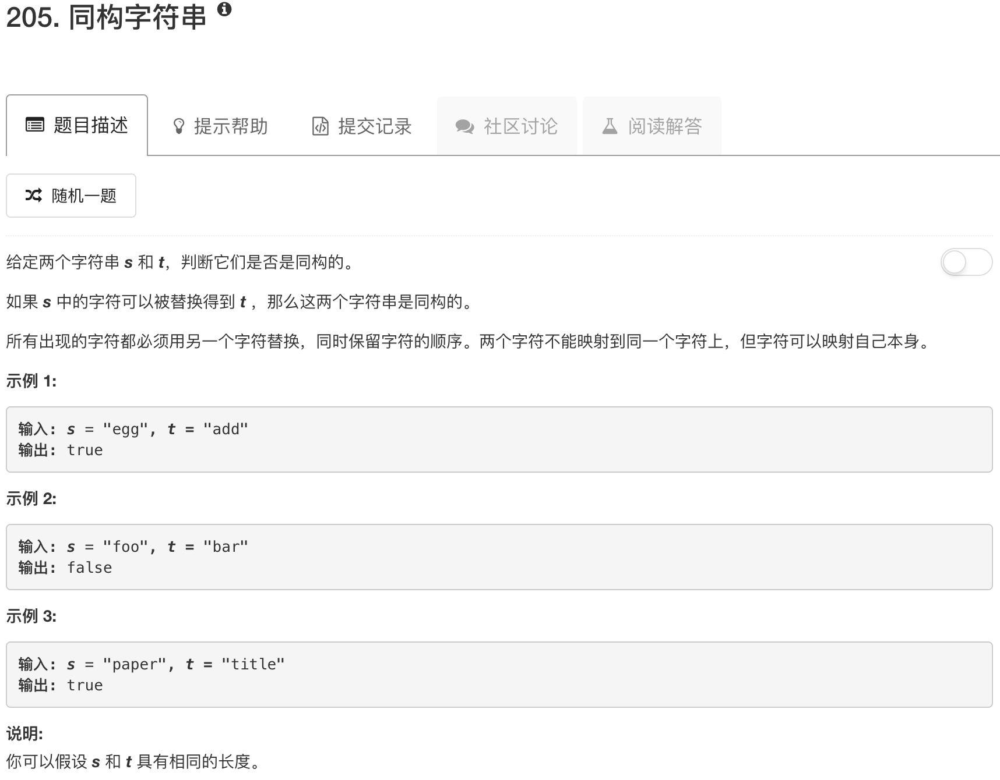

```python
class Solution(object):
    def isIsomorphic(self, s, t):
        """
        :type s: str
        :type t: str
        :rtype: bool
        """
        table1 = {}
        table2 = {}
        for idx in range(len(s)):
            if s[idx] in table1.keys():
                if table1[s[idx]] != t[idx]: return False
            table1[s[idx]] = t[idx]
            if t[idx] in table2.keys():
                if table2[t[idx]] != s[idx]: return False
            table2[t[idx]] = s[idx]
        return True
```

