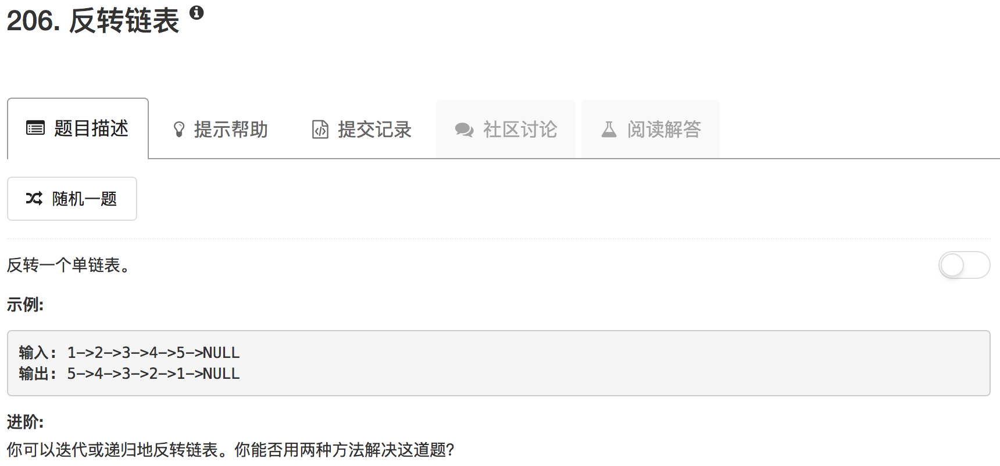
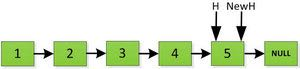
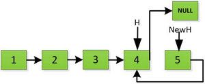
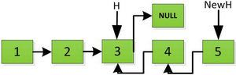
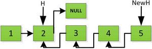
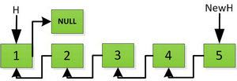

迭代的方法比较容易想，把下一个节点直接接回到链表的头上，直到下一个节点为空，则迭代停止

```python
# Definition for singly-linked list.
# class ListNode(object):
#     def __init__(self, x):
#         self.val = x
#         self.next = None

class Solution(object):
    def reverseList(self, head):
        """
        :type head: ListNode
        :rtype: ListNode
        """
        if not head: return None
        start = head
        while head.next:
            tmp = head.next.next
            head.next.next = start
            start = head.next
            head.next = tmp
        return start
```

递归的方式稍微有点难想。递归一般分成两种方式，一种是自顶向下，另一种是自底向上。对于反转问题，只能采用自底向上。因此，首先需要获得尾节点，这一步可以用代码`self.reverseList(head.next)`获得，因此，在递归边界，上述函数的返回值指向尾节点，而head指向倒数第二个节点。此时，我们可以进行下一步操作，就是将这两个节点进行交换











```python
# Definition for singly-linked list.
# class ListNode(object):
#     def __init__(self, x):
#         self.val = x
#         self.next = None

class Solution(object):
    def reverseList(self, head):
        """
        :type head: ListNode
        :rtype: ListNode
        """
        if not head or not head.next: return head
        newhead = self.reverseList(head.next)
        head.next.next = head
        head.next = None
        return newhead
```

