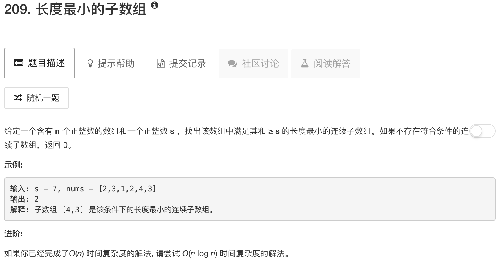

```python
class Solution(object):
    def minSubArrayLen(self, s, nums):
        """
        :type s: int
        :type nums: List[int]
        :rtype: int
        """
        left = 0
        right = 0
        minlen = len(nums) + 1
        numsum = 0
        
        while left < len(nums):
            if right < len(nums) and numsum < s:
                numsum = numsum + nums[right]
                right = right + 1
            else:
                numsum = numsum - nums[left]
                left = left + 1
            if numsum >= s: minlen = min(minlen, right - left)
        if minlen == len(nums) + 1: return 0
        return minlen
```

